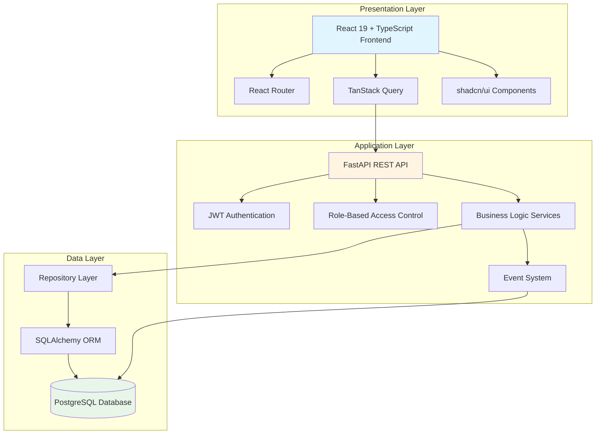
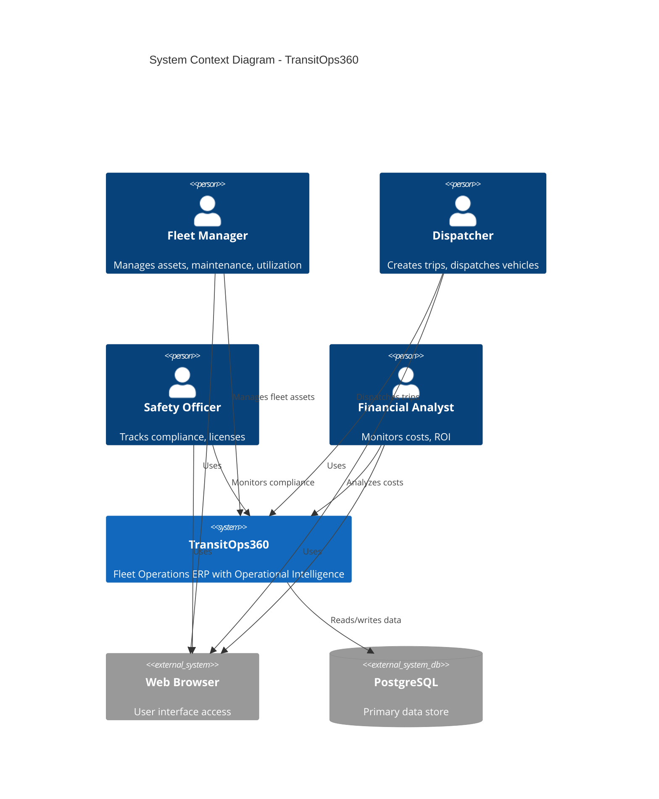
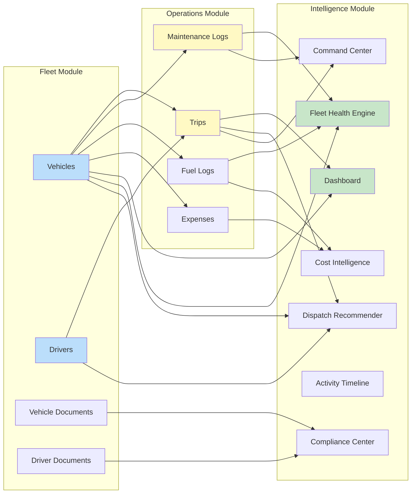
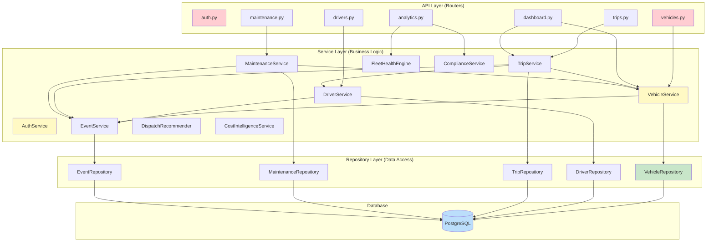
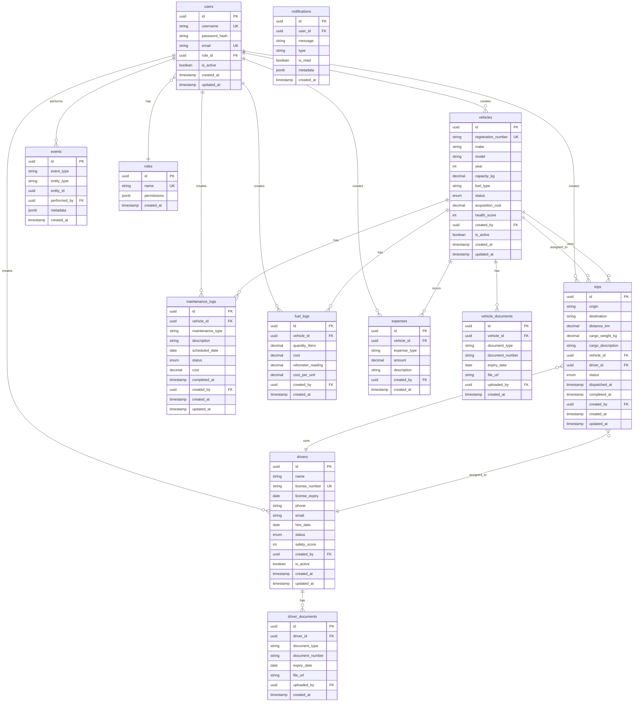
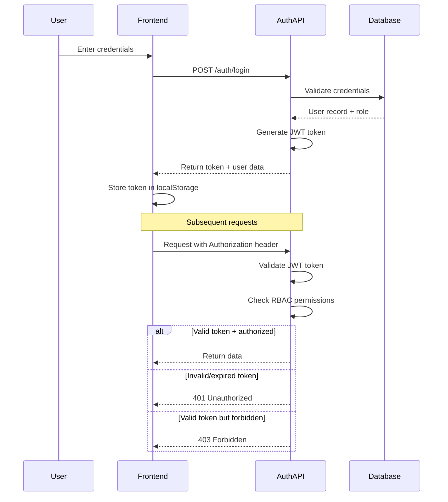
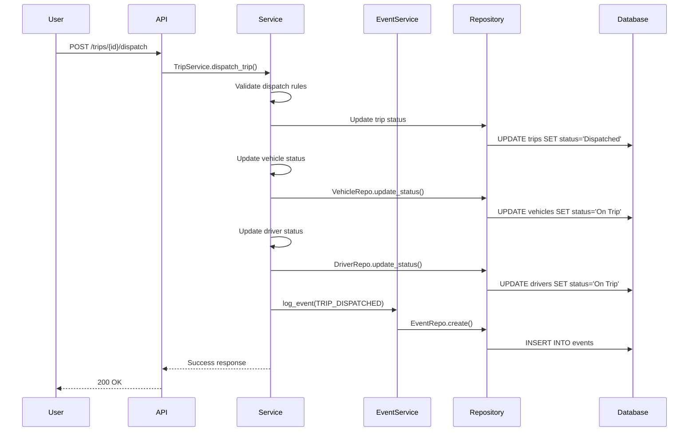

# Design Document: TransitOps360 Platform

## Overview

TransitOps360 is a comprehensive fleet operations ERP and operational intelligence platform designed for a 6-hour hackathon by 2 developers. The system combines traditional fleet management capabilities with innovative operational intelligence features including smart dispatch recommendations, fleet health monitoring, compliance tracking, and cost analytics.

### Design Philosophy

The design follows these core principles optimized for rapid hackathon development:

1. **Spec-Driven Development**: All features trace back to formal requirements with clear acceptance criteria
2. **Domain-Driven Design**: Business logic organized around three core modules (Fleet, Operations, Intelligence)
3. **API-First Design**: Backend services define clear contracts consumed by frontend
4. **Business Rule Driven Workflows**: State machines enforce valid transitions and business constraints
5. **Event-Driven Audit Trail**: All significant actions generate immutable event records
6. **Modular Architecture**: Clear separation of concerns enabling parallel development
7. **Repository Pattern**: Business logic isolated from data access for testability

### Key Objectives

- **Functional Completeness**: Implement all 8 core modules and 6 innovation modules within 6 hours
- **Role-Based Security**: Support 4 distinct user roles with appropriate access controls
- **Operational Intelligence**: Provide actionable insights through smart algorithms
- **Audit Trail**: Complete visibility into all system actions via event architecture
- **Rapid Development**: Leverage modern frameworks and libraries to maximize velocity

## High-Level Architecture

TransitOps360 follows a modern 3-tier architecture with clear separation of concerns:



### Architectural Layers

**Presentation Layer (Frontend)**
- **Technology**: React 19 with TypeScript, TailwindCSS, shadcn/ui
- **Responsibilities**: User interaction, data visualization, form handling, client-side routing
- **State Management**: TanStack Query for server state, React hooks for local state
- **Component Library**: shadcn/ui provides accessible, customizable components

**Application Layer (Backend)**
- **Technology**: FastAPI with Python 3.12+, Pydantic validation
- **Responsibilities**: Business logic, authentication, authorization, API endpoints, event generation
- **Security**: JWT tokens, bcrypt password hashing, role-based access control
- **Layering**: Router → Service → Repository (strict separation, business logic only in services)

**Data Layer**
- **Technology**: PostgreSQL with SQLAlchemy ORM, Alembic migrations
- **Responsibilities**: Data persistence, referential integrity, query optimization
- **Pattern**: Repository pattern abstracts data access from business logic

## System Context Diagram



### System Boundaries

**Internal Systems**
- Authentication & Authorization Service
- Fleet Module (vehicles, drivers)
- Operations Module (trips, maintenance, fuel, expenses)
- Intelligence Module (dashboard, analytics, recommendations, alerts)
- Event System (audit trail, activity timeline)
- Notification System

**External Dependencies**
- PostgreSQL database for persistence
- Web browsers for user interface
- JWT token management
- PDF generation library (for reports)

**Out of Scope**
- GPS tracking integration
- Email delivery services
- External telematics systems
- Payment processing
- Mobile native applications

## Module Architecture

TransitOps360 is organized into three domain modules with clear ownership and responsibilities:



### Fleet Module

**Ownership**: Vehicles, Drivers, Vehicle Documents, Driver Documents

**Responsibilities**:
- Vehicle registration and lifecycle management
- Driver registration and qualification tracking
- Availability status management for both vehicles and drivers
- Document storage and retrieval
- Compliance metadata (license expiry, insurance expiry, permits)

**Key Operations**:
- Register new vehicles with unique registration numbers
- Update vehicle status (Available, On Trip, In Shop, Retired)
- Register drivers with license validation
- Update driver status (Available, On Trip, Off Duty, Suspended)
- Track vehicle and driver documents with expiry dates

**Business Rules**:
- Registration numbers must be unique
- Cannot dispatch vehicles with status In Shop or Retired
- Cannot dispatch drivers with expired licenses or non-Available status
- All status transitions must follow defined state machine rules

### Operations Module

**Ownership**: Trips, Maintenance Logs, Fuel Logs, Expenses

**Responsibilities**:
- Trip creation and lifecycle management (Draft → Dispatched → Completed/Cancelled)
- Vehicle dispatching with validation
- Maintenance request workflow (Active → Completed)
- Fuel consumption tracking
- Operational expense recording

**Key Operations**:
- Create trips with cargo and route details
- Dispatch trips by assigning available vehicles and drivers
- Complete or cancel trips with status rollback
- Open maintenance requests (transitions vehicle to In Shop)
- Close maintenance requests (returns vehicle to Available)
- Log fuel consumption with cost tracking
- Record expenses by type (tolls, repairs)

**Business Rules**:
- Cargo weight cannot exceed vehicle capacity
- Only Available vehicles and drivers can be dispatched
- Trip dispatch transitions both vehicle and driver to On Trip status
- Trip completion/cancellation returns resources to Available
- Opening maintenance transitions vehicle to In Shop
- Closing maintenance returns vehicle to Available

### Intelligence Module

**Ownership**: Dashboard, Fleet Health Engine, Compliance Center, Dispatch Recommendation Engine, Command Center, Activity Timeline, Cost Intelligence

**Responsibilities**:
- Operational visibility through role-specific dashboards
- Decision support through smart algorithms
- Risk identification via compliance tracking
- Performance analytics and cost optimization insights
- Complete audit trail of all system actions

**Key Features**:

**Dashboard**: Aggregated metrics (active vehicles, trips, alerts), recent activity feed

**Fleet Health Engine**: Calculates health scores (0-100) based on maintenance status, age, frequency, fuel efficiency

**Dispatch Recommendation Engine**: Ranks vehicle-driver combinations using scoring formula:
- 40% Capacity Match (cargo weight vs vehicle capacity)
- 30% Fuel Efficiency (km/L rating)
- 20% Health Score (vehicle condition)
- 10% Availability (current status)

**Compliance Center**: Tracks expiry dates for licenses, insurance, permits, fitness certificates, PUC

**Command Center**: Generates operational alerts:
- Driver license expiring (< 30 days)
- Vehicle overdue maintenance
- Underutilized vehicles (< 50% utilization)
- Fuel cost spikes (> 20% above average)
- Negative ROI vehicles

**Activity Timeline**: Chronological audit trail with event filtering by type, entity, date, user

**Cost Intelligence**: Identifies highest cost vehicles, lowest ROI, fuel overspend, average cost/km

## Components and Interfaces

### Backend Architecture

The backend follows a strict layered architecture with dependency flow: Router → Service → Repository → Database



### Service Layer Components

**AuthService**
- Responsibilities: User authentication, JWT token generation and validation, password hashing
- Methods: `authenticate(username, password) → Token`, `validate_token(token) → User`, `hash_password(password) → str`
- Dependencies: UserRepository, bcrypt

**VehicleService**
- Responsibilities: Vehicle CRUD, status management, validation, event generation
- Methods: 
  - `create_vehicle(data) → Vehicle`
  - `update_vehicle_status(id, status) → Vehicle`
  - `get_available_vehicles() → List[Vehicle]`
  - `validate_dispatch_eligibility(vehicle_id) → bool`
- Dependencies: VehicleRepository, EventService

**DriverService**
- Responsibilities: Driver CRUD, status management, license validation, event generation
- Methods:
  - `create_driver(data) → Driver`
  - `update_driver_status(id, status) → Driver`
  - `get_available_drivers() → List[Driver]`
  - `validate_dispatch_eligibility(driver_id) → bool`
  - `check_license_expiry(driver_id) → bool`
- Dependencies: DriverRepository, EventService

**TripService**
- Responsibilities: Trip lifecycle management, dispatch validation, status transitions, resource coordination
- Methods:
  - `create_trip(data) → Trip`
  - `dispatch_trip(trip_id, vehicle_id, driver_id) → Trip`
  - `complete_trip(trip_id) → Trip`
  - `cancel_trip(trip_id) → Trip`
  - `validate_dispatch(trip, vehicle, driver) → ValidationResult`
- Dependencies: TripRepository, VehicleService, DriverService, EventService
- Business Rules:
  - Cargo weight ≤ vehicle capacity
  - Vehicle status = Available
  - Driver status = Available
  - Driver license not expired

**MaintenanceService**
- Responsibilities: Maintenance workflow, vehicle status coordination, cost tracking
- Methods:
  - `open_maintenance(data) → MaintenanceLog`
  - `close_maintenance(id, cost) → MaintenanceLog`
  - `get_vehicle_history(vehicle_id) → List[MaintenanceLog]`
- Dependencies: MaintenanceRepository, VehicleService, EventService

**DispatchRecommenderService**
- Responsibilities: Smart dispatch recommendations using multi-factor scoring
- Methods:
  - `recommend(trip) → List[Recommendation]`
  - `calculate_score(trip, vehicle, driver) → float`
- Scoring Algorithm:
  ```
  score = (0.40 * capacity_match_score) +
          (0.30 * fuel_efficiency_score) +
          (0.20 * health_score) +
          (0.10 * availability_score)
  ```
- Dependencies: VehicleService, DriverService, FleetHealthService

**FleetHealthService**
- Responsibilities: Vehicle health score calculation based on multiple factors
- Methods:
  - `calculate_health_score(vehicle_id) → int`
  - `get_fleet_health_summary() → Dict`
- Health Score Formula:
  ```
  base_score = 100
  if overdue_maintenance: score -= 20
  if age > 5 years: score -= 10
  if maintenance_frequency > 4/year: score -= 15
  if fuel_efficiency < fleet_average: score -= 10
  return max(0, score)
  ```
- Dependencies: VehicleRepository, MaintenanceRepository, FuelRepository

**ComplianceService**
- Responsibilities: Document expiry tracking, compliance status calculation, alert generation
- Methods:
  - `get_compliance_summary() → Dict`
  - `check_driver_compliance(driver_id) → ComplianceStatus`
  - `check_vehicle_compliance(vehicle_id) → ComplianceStatus`
  - `get_expiring_documents(days=30) → List[Document]`
- Dependencies: VehicleRepository, DriverRepository

**CostIntelligenceService**
- Responsibilities: Cost analysis, ROI calculation, overspend identification
- Methods:
  - `calculate_vehicle_total_cost(vehicle_id) → Decimal`
  - `calculate_roi(vehicle_id) → float`
  - `identify_cost_anomalies() → List[Alert]`
  - `get_cost_breakdown() → Dict`
- Dependencies: FuelRepository, MaintenanceRepository, ExpenseRepository, TripRepository

**EventService**
- Responsibilities: Event creation, audit trail management
- Methods:
  - `log_event(event_type, entity_type, entity_id, performed_by, metadata) → Event`
  - `get_timeline(filters) → List[Event]`
- Event Types: VEHICLE_CREATED, VEHICLE_UPDATED, DRIVER_CREATED, TRIP_CREATED, TRIP_DISPATCHED, TRIP_COMPLETED, TRIP_CANCELLED, MAINTENANCE_OPENED, MAINTENANCE_CLOSED, FUEL_LOGGED, EXPENSE_LOGGED
- Dependencies: EventRepository

### Frontend Architecture

```mermaid
graph TD
    subgraph "Pages (Routes)"
        Login[LoginPage]
        Dashboard[DashboardPage]
        Vehicles[VehiclesPage]
        Drivers[DriversPage]
        Trips[TripsPage]
        Maintenance[MaintenancePage]
        Analytics[AnalyticsPage]
    end
    
    subgraph "Module Components"
        VehicleList[VehicleList]
        VehicleForm[VehicleForm]
        DriverList[DriverList]
        DriverForm[DriverForm]
        TripList[TripList]
        TripDispatch[TripDispatchForm]
        DashboardMetrics[MetricsCards]
        AlertsWidget[AlertsWidget]
        Timeline[ActivityTimeline]
        HealthChart[FleetHealthChart]
    end
    
    subgraph "Shared Components"
        Layout[AppLayout]
        Sidebar[Sidebar]
        TopNav[TopNavigation]
        StatusBadge[StatusBadge]
        DataTable[DataTable]
        FormField[FormField]
    end
    
    subgraph "Services (API Layer)"
        AuthAPI[authApi]
        VehicleAPI[vehiclesApi]
        DriverAPI[driversApi]
        TripAPI[tripsApi]
        DashboardAPI[dashboardApi]
    end
    
    subgraph "Hooks"
        useAuth[useAuth]
        useVehicles[useVehicles]
        useDrivers[useDrivers]
        useTrips[useTrips]
    end
    
    Dashboard --> DashboardMetrics
    Dashboard --> AlertsWidget
    Dashboard --> Timeline
    Vehicles --> VehicleList
    Vehicles --> VehicleForm
    Drivers --> DriverList
    Analytics --> HealthChart
    
    VehicleList --> DataTable
    VehicleList --> StatusBadge
    VehicleForm --> FormField
    
    Dashboard --> useAuth
    Vehicles --> useVehicles
    Drivers --> useDrivers
    Trips --> useTrips
    
    useVehicles --> VehicleAPI
    useDrivers --> DriverAPI
    useTrips --> TripAPI
    useAuth --> AuthAPI
    
    VehicleAPI -.HTTP.-> Backend[FastAPI Backend]
    DriverAPI -.HTTP.-> Backend
    TripAPI -.HTTP.-> Backend
    
    style Login fill:#ffcdd2
    style Dashboard fill:#c8e6c9
    style Backend fill:#bbdefb
```



### Frontend Component Hierarchy

**Pages** (Route-level components)
- LoginPage: Authentication form
- DashboardPage: Role-specific metrics, alerts, activity feed
- VehiclesPage: Vehicle CRUD interface
- DriversPage: Driver CRUD interface
- TripsPage: Trip management and dispatch interface
- MaintenancePage: Maintenance workflow interface
- AnalyticsPage: Charts, health scores, compliance, cost intelligence

**Module Components** (Feature-specific)
- VehicleList: Paginated table with search, filter, sort
- VehicleForm: Create/edit form with validation (React Hook Form + Zod)
- DriverList: Paginated table with license status indicators
- DriverForm: Create/edit form with license validation
- TripList: Trip status visualization, dispatch actions
- TripDispatchForm: Vehicle/driver selection with smart recommendations
- DashboardMetrics: KPI cards (active vehicles, trips, alerts)
- AlertsWidget: Command center alerts with severity badges
- ActivityTimeline: Chronological event list with filtering
- FleetHealthChart: Health score visualization (Recharts)
- ComplianceTable: Document expiry status grid
- CostAnalysisChart: Cost breakdown visualization

**Shared Components** (Reusable UI)
- AppLayout: Sidebar + TopNav + Content area wrapper
- Sidebar: Navigation menu with role-based visibility
- TopNavigation: User profile, notifications, logout
- StatusBadge: Color-coded status indicator (consistent design system)
- DataTable: Generic table with pagination, sorting (using shadcn/ui Table)
- FormField: Labeled input with validation error display
- Modal: Generic dialog wrapper
- Button: Styled button with variants
- Card: Content container

### API Service Layer (Frontend)

**Purpose**: Encapsulate all HTTP communication with backend

**Structure**:
```typescript
// services/api/vehicles.ts
export const vehiclesApi = {
  getAll: (filters?) => axios.get('/api/vehicles', { params: filters }),
  getById: (id) => axios.get(`/api/vehicles/${id}`),
  create: (data) => axios.post('/api/vehicles', data),
  update: (id, data) => axios.put(`/api/vehicles/${id}`, data),
  delete: (id) => axios.delete(`/api/vehicles/${id}`),
  updateStatus: (id, status) => axios.patch(`/api/vehicles/${id}/status`, { status })
}
```

**Custom Hooks** (React Query integration):
```typescript
// hooks/useVehicles.ts
export const useVehicles = (filters?) => {
  return useQuery({
    queryKey: ['vehicles', filters],
    queryFn: () => vehiclesApi.getAll(filters)
  })
}

export const useCreateVehicle = () => {
  const queryClient = useQueryClient()
  return useMutation({
    mutationFn: vehiclesApi.create,
    onSuccess: () => {
      queryClient.invalidateQueries({ queryKey: ['vehicles'] })
    }
  })
}
```

## Data Models

### Entity Relationship Diagram



### Database Schema Details

**users**
- Primary entity for authentication and authorization
- Soft delete via `is_active` flag
- Foreign key to roles for RBAC
- Password stored as bcrypt hash
- Audit fields: created_at, updated_at

**roles**
- Predefined roles: Fleet_Manager, Dispatcher, Safety_Officer, Financial_Analyst
- Permissions stored as JSONB for flexibility
- Static seed data (not user-modifiable in MVP)

**vehicles**
- Unique constraint on registration_number
- Status enum: Available, On Trip, In Shop, Retired
- Health score calculated by FleetHealthService (0-100)
- Acquisition cost for ROI calculations
- Soft delete via is_active

**vehicle_documents**
- Supports multiple document types: insurance, permit, fitness_certificate, puc
- Expiry dates tracked for compliance
- File storage (URL reference, actual storage out of scope for hackathon)

**drivers**
- Unique constraint on license_number
- License expiry date for compliance validation
- Status enum: Available, On Trip, Off Duty, Suspended
- Safety score calculated based on trip history
- Soft delete via is_active

**driver_documents**
- Supports document types: license, medical_certificate
- Expiry tracking for compliance

**trips**
- Status enum: Draft, Dispatched, Completed, Cancelled
- Foreign keys to vehicles and drivers (nullable until dispatch)
- Cargo weight validated against vehicle capacity
- Timestamps track dispatch and completion

**maintenance_logs**
- Status enum: Active, Completed
- Types: Scheduled, Breakdown, Inspection
- Cost tracked for expense analysis
- Links to vehicle for history

**fuel_logs**
- Immutable records (no updates after creation)
- Cost per unit calculated automatically
- Odometer reading for efficiency tracking

**expenses**
- Types: tolls, repairs, other
- Links to vehicle for cost aggregation
- Immutable records

**events**
- Immutable audit trail
- JSONB metadata stores action-specific details
- Indexed on entity_type, entity_id for timeline queries
- Event types enumerated in EventService

**notifications**
- User-specific alerts
- Read/unread status tracking
- Metadata stores alert details and links

### Index Strategy

**Performance-Critical Indexes**:
- `users.username` (unique, auth queries)
- `users.email` (unique, lookup)
- `vehicles.registration_number` (unique, search)
- `vehicles.status` (filtering available vehicles)
- `drivers.license_number` (unique, search)
- `drivers.status` (filtering available drivers)
- `trips.status` (filtering active trips)
- `trips.vehicle_id` (vehicle history)
- `trips.driver_id` (driver history)
- `events.entity_type, entity_id` (timeline queries)
- `events.created_at DESC` (recent activity)
- `maintenance_logs.vehicle_id, status` (active maintenance)
- `fuel_logs.vehicle_id, created_at` (consumption history)

### Constraints

**Unique Constraints**:
- users.username
- users.email
- vehicles.registration_number
- drivers.license_number
- roles.name

**Foreign Key Constraints** (with CASCADE behavior):
- All created_by fields → users.id (ON DELETE SET NULL for audit preservation)
- vehicles.created_by, drivers.created_by, trips.created_by (SET NULL on user deletion)
- trips.vehicle_id → vehicles.id (RESTRICT: cannot delete vehicle with active trips)
- trips.driver_id → drivers.id (RESTRICT: cannot delete driver with active trips)
- maintenance_logs.vehicle_id → vehicles.id (CASCADE: delete maintenance with vehicle)
- fuel_logs.vehicle_id → vehicles.id (CASCADE)
- expenses.vehicle_id → vehicles.id (CASCADE)
- events.performed_by → users.id (SET NULL)

**Check Constraints**:
- vehicles.capacity_kg > 0
- vehicles.acquisition_cost >= 0
- vehicles.year >= 1900 AND year <= CURRENT_YEAR + 1
- trips.cargo_weight_kg > 0
- trips.distance_km > 0
- maintenance_logs.cost >= 0
- fuel_logs.quantity_liters > 0
- fuel_logs.cost > 0
- expenses.amount > 0


## Service Boundaries

The system is organized into 8 logical services with clear API boundaries:

### 1. Authentication Service

**Base Path**: `/api/auth`

**Responsibilities**:
- User authentication
- JWT token issuance and validation
- Password hashing and verification

**Endpoints**:
- `POST /auth/login` - Authenticate user and issue JWT
- `POST /auth/refresh` - Refresh expired token
- `GET /auth/me` - Get current user profile

**Dependencies**: UserRepository

---

### 2. Fleet Service (Vehicles)

**Base Path**: `/api/vehicles`

**Responsibilities**:
- Vehicle CRUD operations
- Status management
- Availability tracking
- Document management
- Dispatch eligibility validation

**Endpoints**:
- `GET /vehicles` - List vehicles with filters
- `GET /vehicles/{id}` - Get vehicle details
- `POST /vehicles` - Register new vehicle
- `PUT /vehicles/{id}` - Update vehicle
- `DELETE /vehicles/{id}` - Soft delete vehicle
- `PATCH /vehicles/{id}/status` - Update status
- `GET /vehicles/available` - Get available vehicles
- `POST /vehicles/{id}/documents` - Upload document
- `GET /vehicles/{id}/documents` - List documents

**Dependencies**: VehicleRepository, EventService


---

### 3. Fleet Service (Drivers)

**Base Path**: `/api/drivers`

**Responsibilities**:
- Driver CRUD operations
- Status management
- License validation
- Document management
- Dispatch eligibility validation

**Endpoints**:
- `GET /drivers` - List drivers with filters
- `GET /drivers/{id}` - Get driver details
- `POST /drivers` - Register new driver
- `PUT /drivers/{id}` - Update driver
- `DELETE /drivers/{id}` - Soft delete driver
- `PATCH /drivers/{id}/status` - Update status
- `GET /drivers/available` - Get available drivers
- `POST /drivers/{id}/documents` - Upload document
- `GET /drivers/{id}/documents` - List documents

**Dependencies**: DriverRepository, EventService

---

### 4. Operations Service (Trips)

**Base Path**: `/api/trips`

**Responsibilities**:
- Trip lifecycle management
- Dispatch orchestration
- Status transitions
- Resource coordination

**Endpoints**:
- `GET /trips` - List trips with filters
- `GET /trips/{id}` - Get trip details
- `POST /trips` - Create new trip
- `PUT /trips/{id}` - Update trip
- `POST /trips/{id}/dispatch` - Dispatch trip
- `POST /trips/{id}/complete` - Complete trip
- `POST /trips/{id}/cancel` - Cancel trip
- `GET /trips/active` - Get active trips

**Dependencies**: TripRepository, VehicleService, DriverService, EventService


---

### 5. Operations Service (Maintenance)

**Base Path**: `/api/maintenance`

**Responsibilities**:
- Maintenance workflow management
- Vehicle status coordination
- Maintenance history tracking

**Endpoints**:
- `GET /maintenance` - List maintenance logs with filters
- `GET /maintenance/{id}` - Get maintenance details
- `POST /maintenance` - Open maintenance request
- `POST /maintenance/{id}/complete` - Close maintenance
- `GET /maintenance/vehicle/{vehicle_id}` - Get vehicle maintenance history

**Dependencies**: MaintenanceRepository, VehicleService, EventService

---

### 6. Operations Service (Fuel & Expenses)

**Base Path**: `/api/fuel`, `/api/expenses`

**Responsibilities**:
- Fuel consumption logging
- Expense recording
- Cost tracking

**Endpoints**:
- `GET /fuel` - List fuel logs
- `POST /fuel` - Log fuel consumption
- `GET /fuel/vehicle/{vehicle_id}` - Get vehicle fuel history
- `GET /expenses` - List expenses
- `POST /expenses` - Log expense
- `GET /expenses/vehicle/{vehicle_id}` - Get vehicle expenses

**Dependencies**: FuelRepository, ExpenseRepository, EventService

---

### 7. Intelligence Service

**Base Path**: `/api/dashboard`, `/api/analytics`, `/api/recommendations`

**Responsibilities**:
- Dashboard aggregation
- Smart dispatch recommendations
- Fleet health calculation
- Compliance tracking
- Cost intelligence
- Command center alerts

**Endpoints**:
- `GET /dashboard/summary` - Get role-specific dashboard data
- `GET /analytics/health` - Get fleet health scores
- `GET /analytics/compliance` - Get compliance status
- `GET /analytics/costs` - Get cost intelligence
- `GET /analytics/utilization` - Get utilization metrics
- `POST /recommendations/dispatch` - Get dispatch recommendations
- `GET /alerts/command-center` - Get active alerts

**Dependencies**: All repositories, HealthService, ComplianceService, CostService, DispatchService


---

### 8. Event Service

**Base Path**: `/api/events`

**Responsibilities**:
- Event logging
- Activity timeline
- Audit trail queries

**Endpoints**:
- `GET /events` - Get activity timeline with filters
- `GET /events/entity/{entity_type}/{entity_id}` - Get entity-specific events

**Dependencies**: EventRepository

---

## API Architecture

### RESTful API Design

All API endpoints follow REST conventions:
- **GET**: Retrieve resources (idempotent)
- **POST**: Create resources or trigger actions
- **PUT**: Full resource update
- **PATCH**: Partial resource update
- **DELETE**: Remove resource (soft delete)

### Standard Request/Response Format

**Success Response** (200, 201):
```json
{
  "data": { /* resource or list */ },
  "message": "Success message",
  "timestamp": "2024-01-15T10:30:00Z"
}
```

**Error Response** (400, 401, 403, 404, 500):
```json
{
  "error": "Error message",
  "detail": "Detailed error information",
  "code": "ERROR_CODE",
  "timestamp": "2024-01-15T10:30:00Z"
}
```

**Validation Error Response** (422):
```json
{
  "error": "Validation failed",
  "errors": [
    {
      "field": "registration_number",
      "message": "Registration number already exists"
    }
  ],
  "timestamp": "2024-01-15T10:30:00Z"
}
```


### Key API Endpoints Specification

#### Authentication

**POST /api/auth/login**
```
Request:
{
  "username": "fleet_manager_1",
  "password": "securepassword"
}

Response (200):
{
  "data": {
    "access_token": "eyJhbGc...",
    "token_type": "bearer",
    "expires_in": 3600,
    "user": {
      "id": "uuid",
      "username": "fleet_manager_1",
      "email": "manager@example.com",
      "role": "Fleet_Manager"
    }
  }
}
```

**GET /api/auth/me**
```
Headers: Authorization: Bearer {token}

Response (200):
{
  "data": {
    "id": "uuid",
    "username": "fleet_manager_1",
    "email": "manager@example.com",
    "role": "Fleet_Manager",
    "permissions": ["manage_vehicles", "view_maintenance", ...]
  }
}
```

#### Vehicles

**POST /api/vehicles**
```
Request:
{
  "registration_number": "MH12AB1234",
  "make": "Tata",
  "model": "Ace",
  "year": 2023,
  "capacity_kg": 1500,
  "fuel_type": "Diesel",
  "acquisition_cost": 500000
}

Response (201):
{
  "data": {
    "id": "uuid",
    "registration_number": "MH12AB1234",
    "make": "Tata",
    "model": "Ace",
    "year": 2023,
    "capacity_kg": 1500,
    "fuel_type": "Diesel",
    "status": "Available",
    "acquisition_cost": 500000,
    "health_score": 100,
    "created_at": "2024-01-15T10:30:00Z"
  },
  "message": "Vehicle registered successfully"
}
```

**GET /api/vehicles?status=Available&fuel_type=Diesel**
```
Response (200):
{
  "data": [
    { /* vehicle object */ },
    { /* vehicle object */ }
  ],
  "pagination": {
    "page": 1,
    "per_page": 20,
    "total": 45,
    "pages": 3
  }
}
```

**PATCH /api/vehicles/{id}/status**
```
Request:
{
  "status": "In Shop",
  "reason": "Scheduled maintenance"
}

Response (200):
{
  "data": {
    "id": "uuid",
    "status": "In Shop",
    "updated_at": "2024-01-15T10:35:00Z"
  }
}
```


#### Trips

**POST /api/trips**
```
Request:
{
  "origin": "Mumbai",
  "destination": "Pune",
  "distance_km": 150,
  "cargo_weight_kg": 1200,
  "cargo_description": "Electronics"
}

Response (201):
{
  "data": {
    "id": "uuid",
    "origin": "Mumbai",
    "destination": "Pune",
    "distance_km": 150,
    "cargo_weight_kg": 1200,
    "cargo_description": "Electronics",
    "status": "Draft",
    "vehicle_id": null,
    "driver_id": null,
    "created_at": "2024-01-15T10:30:00Z"
  }
}
```

**POST /api/trips/{id}/dispatch**
```
Request:
{
  "vehicle_id": "uuid",
  "driver_id": "uuid"
}

Response (200):
{
  "data": {
    "id": "uuid",
    "status": "Dispatched",
    "vehicle_id": "uuid",
    "driver_id": "uuid",
    "dispatched_at": "2024-01-15T10:35:00Z"
  },
  "message": "Trip dispatched successfully"
}

Error Response (400):
{
  "error": "Dispatch validation failed",
  "detail": "Cargo weight (1500 kg) exceeds vehicle capacity (1200 kg)",
  "code": "CAPACITY_EXCEEDED"
}
```

**POST /api/trips/{id}/complete**
```
Response (200):
{
  "data": {
    "id": "uuid",
    "status": "Completed",
    "completed_at": "2024-01-15T14:30:00Z",
    "vehicle": {
      "id": "uuid",
      "status": "Available"
    },
    "driver": {
      "id": "uuid",
      "status": "Available"
    }
  }
}
```

#### Dashboard

**GET /api/dashboard/summary**
```
Response (200):
{
  "data": {
    "metrics": {
      "total_vehicles": 50,
      "active_vehicles": 42,
      "vehicles_on_trip": 18,
      "vehicles_in_shop": 3,
      "total_drivers": 30,
      "active_trips": 18,
      "pending_trips": 5,
      "fleet_utilization": 75.5,
      "maintenance_count": 3
    },
    "active_trips": [
      {
        "id": "uuid",
        "origin": "Mumbai",
        "destination": "Pune",
        "vehicle": "MH12AB1234",
        "driver": "John Doe",
        "dispatched_at": "2024-01-15T10:00:00Z"
      }
    ],
    "alerts": [
      {
        "type": "LICENSE_EXPIRING",
        "severity": "HIGH",
        "message": "Driver license expiring in 15 days",
        "entity": "John Doe",
        "created_at": "2024-01-15T08:00:00Z"
      }
    ],
    "recent_activity": [
      {
        "event_type": "TRIP_DISPATCHED",
        "entity_type": "Trip",
        "entity_id": "uuid",
        "performed_by": "dispatcher_1",
        "timestamp": "2024-01-15T10:35:00Z"
      }
    ]
  }
}
```


#### Smart Dispatch Recommendations

**POST /api/recommendations/dispatch**
```
Request:
{
  "trip_id": "uuid"
}

Response (200):
{
  "data": {
    "recommendations": [
      {
        "rank": 1,
        "score": 92.5,
        "vehicle": {
          "id": "uuid",
          "registration_number": "MH12AB1234",
          "capacity_kg": 1500,
          "fuel_efficiency": 18.5,
          "health_score": 95
        },
        "driver": {
          "id": "uuid",
          "name": "John Doe",
          "safety_score": 98
        },
        "reasoning": {
          "capacity_match": "Excellent (80% utilization)",
          "fuel_efficiency": "Above fleet average",
          "health_score": "Healthy vehicle",
          "availability": "Immediately available"
        }
      },
      {
        "rank": 2,
        "score": 87.3,
        "vehicle": { /* ... */ },
        "driver": { /* ... */ },
        "reasoning": { /* ... */ }
      }
    ],
    "trip": {
      "id": "uuid",
      "cargo_weight_kg": 1200,
      "distance_km": 150
    }
  }
}
```

#### Fleet Analytics

**GET /api/analytics/health**
```
Response (200):
{
  "data": {
    "fleet_health_summary": {
      "average_health_score": 82.5,
      "healthy_vehicles": 35,
      "at_risk_vehicles": 12,
      "critical_vehicles": 3
    },
    "vehicles": [
      {
        "id": "uuid",
        "registration_number": "MH12AB1234",
        "health_score": 95,
        "risk_level": "Healthy",
        "factors": {
          "maintenance_status": "Current",
          "age_years": 2,
          "maintenance_frequency": 2,
          "fuel_efficiency": "Above average"
        }
      }
    ]
  }
}
```

**GET /api/analytics/compliance**
```
Response (200):
{
  "data": {
    "compliance_summary": {
      "total_items": 150,
      "compliant": 120,
      "expiring_soon": 20,
      "expired": 10
    },
    "expiring_documents": [
      {
        "entity_type": "Driver",
        "entity_id": "uuid",
        "entity_name": "John Doe",
        "document_type": "license",
        "expiry_date": "2024-02-01",
        "days_until_expiry": 17,
        "status": "EXPIRING"
      }
    ]
  }
}
```


## Security Architecture

### Authentication Flow



### JWT Token Structure

**Token Payload**:
```json
{
  "sub": "user_id",
  "username": "fleet_manager_1",
  "role": "Fleet_Manager",
  "exp": 1705326000,
  "iat": 1705322400
}
```

**Token Configuration**:
- Algorithm: HS256
- Secret Key: Environment variable (JWT_SECRET_KEY)
- Expiration: 1 hour (configurable)
- Refresh mechanism: Separate refresh token endpoint

### Password Security

**Hashing Strategy**:
- Algorithm: bcrypt
- Salt rounds: 12 (configurable)
- No plaintext passwords stored
- Password validation: Minimum 8 characters (enforced at API level)

**Implementation**:
```python
from passlib.context import CryptContext

pwd_context = CryptContext(schemes=["bcrypt"], deprecated="auto")

def hash_password(password: str) -> str:
    return pwd_context.hash(password)

def verify_password(plain_password: str, hashed_password: str) -> bool:
    return pwd_context.verify(plain_password, hashed_password)
```


### Role-Based Access Control (RBAC)

**Permission Matrix**:

| Feature | Fleet_Manager | Dispatcher | Safety_Officer | Financial_Analyst |
|---------|--------------|------------|----------------|-------------------|
| View Dashboard | ✓ | ✓ | ✓ | ✓ |
| Manage Vehicles | ✓ | View Only | View Only | View Only |
| Manage Drivers | ✓ | View Only | ✓ | View Only |
| Create Trips | ✓ | ✓ | ✗ | ✗ |
| Dispatch Trips | ✓ | ✓ | ✗ | ✗ |
| Manage Maintenance | ✓ | View Only | View Only | View Only |
| Log Fuel | ✓ | ✓ | ✗ | View Only |
| Log Expenses | ✓ | ✓ | ✗ | ✓ |
| View Analytics | ✓ | ✓ | ✓ | ✓ |
| View Compliance | ✓ | View Only | ✓ | View Only |
| View Cost Intelligence | ✓ | View Only | View Only | ✓ |
| Export Reports | ✓ | ✓ | ✓ | ✓ |

**Implementation Strategy**:

1. **Database Level**: Roles table with permissions JSONB column
2. **API Level**: Decorator-based permission checks on endpoints
3. **Frontend Level**: Conditional rendering based on user role

**FastAPI Decorator Example**:
```python
from functools import wraps
from fastapi import Depends, HTTPException, status

def require_role(*allowed_roles):
    def decorator(func):
        @wraps(func)
        async def wrapper(*args, current_user: User = Depends(get_current_user), **kwargs):
            if current_user.role not in allowed_roles:
                raise HTTPException(
                    status_code=status.HTTP_403_FORBIDDEN,
                    detail=f"Role {current_user.role} not authorized"
                )
            return await func(*args, current_user=current_user, **kwargs)
        return wrapper
    return decorator

@router.post("/vehicles")
@require_role("Fleet_Manager")
async def create_vehicle(data: VehicleCreate, current_user: User = Depends(get_current_user)):
    # Only Fleet_Manager can access
    pass
```

### API Security Measures

**Input Validation**:
- Pydantic models for all request bodies
- Type checking and coercion
- Custom validators for business rules
- SQL injection prevention via ORM parameterization

**Rate Limiting** (for production):
- Authentication endpoints: 5 requests/minute per IP
- Standard endpoints: 100 requests/minute per user
- Implementation: SlowAPI library or Redis-based

**CORS Configuration**:
- Development: Allow localhost origins
- Production: Whitelist specific frontend domain
- Credentials allowed for cookie-based auth (if used)

**HTTPS Enforcement** (production):
- All API traffic over HTTPS
- HTTP Strict Transport Security (HSTS) headers
- Secure cookie flags


## Event Architecture

### Event-Driven Audit Trail

All significant system actions generate immutable event records for complete audit visibility.

### Event Types

**Fleet Events**:
- `VEHICLE_CREATED`: New vehicle registered
- `VEHICLE_UPDATED`: Vehicle details modified
- `VEHICLE_STATUS_CHANGED`: Status transition (Available ↔ On Trip ↔ In Shop ↔ Retired)
- `VEHICLE_RETIRED`: Vehicle permanently retired
- `DRIVER_CREATED`: New driver registered
- `DRIVER_UPDATED`: Driver details modified
- `DRIVER_STATUS_CHANGED`: Status transition (Available ↔ On Trip ↔ Off Duty ↔ Suspended)

**Operations Events**:
- `TRIP_CREATED`: Trip created in Draft status
- `TRIP_DISPATCHED`: Trip dispatched with vehicle and driver assigned
- `TRIP_COMPLETED`: Trip successfully completed
- `TRIP_CANCELLED`: Trip cancelled
- `MAINTENANCE_OPENED`: Maintenance request created
- `MAINTENANCE_CLOSED`: Maintenance completed
- `FUEL_LOGGED`: Fuel consumption recorded
- `EXPENSE_LOGGED`: Expense recorded

**Intelligence Events** (for future features):
- `ALERT_GENERATED`: System alert created
- `NOTIFICATION_SENT`: User notification sent

### Event Flow




### Event Metadata Structure

Events include rich metadata in JSONB format for detailed audit trails:

**TRIP_DISPATCHED Event**:
```json
{
  "event_type": "TRIP_DISPATCHED",
  "entity_type": "Trip",
  "entity_id": "trip-uuid",
  "performed_by": "dispatcher_user_id",
  "metadata": {
    "trip_details": {
      "origin": "Mumbai",
      "destination": "Pune",
      "distance_km": 150,
      "cargo_weight_kg": 1200
    },
    "vehicle": {
      "id": "vehicle-uuid",
      "registration_number": "MH12AB1234",
      "previous_status": "Available",
      "new_status": "On Trip"
    },
    "driver": {
      "id": "driver-uuid",
      "name": "John Doe",
      "previous_status": "Available",
      "new_status": "On Trip"
    },
    "dispatch_timestamp": "2024-01-15T10:35:00Z"
  },
  "created_at": "2024-01-15T10:35:00Z"
}
```

**MAINTENANCE_OPENED Event**:
```json
{
  "event_type": "MAINTENANCE_OPENED",
  "entity_type": "MaintenanceLog",
  "entity_id": "maintenance-uuid",
  "performed_by": "fleet_manager_user_id",
  "metadata": {
    "vehicle": {
      "id": "vehicle-uuid",
      "registration_number": "MH12AB1234",
      "previous_status": "Available",
      "new_status": "In Shop"
    },
    "maintenance_type": "Scheduled",
    "description": "500 km service",
    "scheduled_date": "2024-01-20"
  },
  "created_at": "2024-01-15T11:00:00Z"
}
```

### Activity Timeline Interface

**Frontend Display**:
- Chronological list (newest first)
- Filters: entity type, date range, user
- Search by entity ID or description
- Event detail expansion
- Color coding by event type

**API Query Patterns**:
```sql
-- Recent activity for dashboard
SELECT * FROM events 
ORDER BY created_at DESC 
LIMIT 10;

-- Vehicle-specific timeline
SELECT * FROM events 
WHERE entity_type = 'Vehicle' AND entity_id = ?
ORDER BY created_at DESC;

-- User action history
SELECT * FROM events 
WHERE performed_by = ?
ORDER BY created_at DESC;

-- Trip lifecycle audit
SELECT * FROM events 
WHERE entity_type = 'Trip' AND entity_id = ?
ORDER BY created_at ASC;
```


## Folder Structure

### Complete Repository Structure

```
TransitOps360/
├── frontend/                      # React TypeScript frontend
│   ├── public/
│   │   ├── index.html
│   │   └── favicon.ico
│   ├── src/
│   │   ├── pages/                # Route-level components
│   │   │   ├── LoginPage.tsx
│   │   │   ├── DashboardPage.tsx
│   │   │   ├── VehiclesPage.tsx
│   │   │   ├── DriversPage.tsx
│   │   │   ├── TripsPage.tsx
│   │   │   ├── MaintenancePage.tsx
│   │   │   ├── FuelPage.tsx
│   │   │   ├── ExpensesPage.tsx
│   │   │   └── AnalyticsPage.tsx
│   │   ├── modules/              # Feature-specific components
│   │   │   ├── dashboard/
│   │   │   │   ├── MetricsCards.tsx
│   │   │   │   ├── AlertsWidget.tsx
│   │   │   │   ├── ActiveTripsTable.tsx
│   │   │   │   └── ActivityFeed.tsx
│   │   │   ├── vehicles/
│   │   │   │   ├── VehicleList.tsx
│   │   │   │   ├── VehicleForm.tsx
│   │   │   │   ├── VehicleDetails.tsx
│   │   │   │   └── VehicleStatusBadge.tsx
│   │   │   ├── drivers/
│   │   │   │   ├── DriverList.tsx
│   │   │   │   ├── DriverForm.tsx
│   │   │   │   └── DriverDetails.tsx
│   │   │   ├── trips/
│   │   │   │   ├── TripList.tsx
│   │   │   │   ├── TripForm.tsx
│   │   │   │   ├── TripDispatchForm.tsx
│   │   │   │   └── TripDetails.tsx
│   │   │   ├── maintenance/
│   │   │   │   ├── MaintenanceList.tsx
│   │   │   │   ├── MaintenanceForm.tsx
│   │   │   │   └── MaintenanceHistory.tsx
│   │   │   ├── analytics/
│   │   │   │   ├── FleetHealthChart.tsx
│   │   │   │   ├── ComplianceTable.tsx
│   │   │   │   ├── CostAnalysisChart.tsx
│   │   │   │   ├── UtilizationChart.tsx
│   │   │   │   └── CommandCenter.tsx
│   │   │   └── compliance/
│   │   │       ├── ComplianceOverview.tsx
│   │   │       └── ExpiringDocuments.tsx
│   │   ├── components/           # Shared UI components
│   │   │   ├── ui/              # shadcn/ui components
│   │   │   │   ├── button.tsx
│   │   │   │   ├── card.tsx
│   │   │   │   ├── table.tsx
│   │   │   │   ├── form.tsx
│   │   │   │   ├── input.tsx
│   │   │   │   ├── select.tsx
│   │   │   │   ├── badge.tsx
│   │   │   │   ├── dialog.tsx
│   │   │   │   └── ...
│   │   │   ├── StatusBadge.tsx
│   │   │   ├── DataTable.tsx
│   │   │   ├── LoadingSpinner.tsx
│   │   │   └── ErrorBoundary.tsx
│   │   ├── layouts/              # Layout components
│   │   │   ├── AppLayout.tsx
│   │   │   ├── Sidebar.tsx
│   │   │   ├── TopNavigation.tsx
│   │   │   └── AuthLayout.tsx
│   │   ├── hooks/                # Custom React hooks
│   │   │   ├── useAuth.ts
│   │   │   ├── useVehicles.ts
│   │   │   ├── useDrivers.ts
│   │   │   ├── useTrips.ts
│   │   │   ├── useMaintenance.ts
│   │   │   ├── useDashboard.ts
│   │   │   └── useAnalytics.ts
│   │   ├── services/             # API service layer
│   │   │   ├── api/
│   │   │   │   ├── client.ts    # Axios instance with interceptors
│   │   │   │   ├── auth.ts
│   │   │   │   ├── vehicles.ts
│   │   │   │   ├── drivers.ts
│   │   │   │   ├── trips.ts
│   │   │   │   ├── maintenance.ts
│   │   │   │   ├── fuel.ts
│   │   │   │   ├── expenses.ts
│   │   │   │   ├── dashboard.ts
│   │   │   │   └── analytics.ts
│   │   │   └── queryClient.ts   # TanStack Query configuration
│   │   ├── routes/               # Route configuration
│   │   │   ├── index.tsx
│   │   │   ├── ProtectedRoute.tsx
│   │   │   └── RoleBasedRoute.tsx
│   │   ├── types/                # TypeScript type definitions
│   │   │   ├── auth.ts
│   │   │   ├── vehicle.ts
│   │   │   ├── driver.ts
│   │   │   ├── trip.ts
│   │   │   ├── maintenance.ts
│   │   │   ├── dashboard.ts
│   │   │   └── api.ts
│   │   ├── utils/                # Utility functions
│   │   │   ├── formatters.ts
│   │   │   ├── validators.ts
│   │   │   ├── constants.ts
│   │   │   └── storage.ts
│   │   ├── App.tsx
│   │   ├── main.tsx
│   │   └── index.css
│   ├── package.json
│   ├── tsconfig.json
│   ├── vite.config.ts
│   ├── tailwind.config.js
│   └── components.json           # shadcn/ui config
├── backend/                       # FastAPI Python backend
│   ├── app/
│   │   ├── api/                  # API route handlers
│   │   │   ├── v1/
│   │   │   │   ├── __init__.py
│   │   │   │   ├── auth.py
│   │   │   │   ├── vehicles.py
│   │   │   │   ├── drivers.py
│   │   │   │   ├── trips.py
│   │   │   │   ├── maintenance.py
│   │   │   │   ├── fuel.py
│   │   │   │   ├── expenses.py
│   │   │   │   ├── dashboard.py
│   │   │   │   ├── analytics.py
│   │   │   │   ├── recommendations.py
│   │   │   │   └── events.py
│   │   │   └── __init__.py
│   │   ├── services/             # Business logic layer
│   │   │   ├── __init__.py
│   │   │   ├── auth_service.py
│   │   │   ├── vehicle_service.py
│   │   │   ├── driver_service.py
│   │   │   ├── trip_service.py
│   │   │   ├── maintenance_service.py
│   │   │   ├── fuel_service.py
│   │   │   ├── expense_service.py
│   │   │   ├── event_service.py
│   │   │   ├── dispatch_recommender.py
│   │   │   ├── fleet_health_engine.py
│   │   │   ├── compliance_service.py
│   │   │   └── cost_intelligence.py
│   │   ├── repositories/         # Data access layer
│   │   │   ├── __init__.py
│   │   │   ├── base_repository.py
│   │   │   ├── user_repository.py
│   │   │   ├── vehicle_repository.py
│   │   │   ├── driver_repository.py
│   │   │   ├── trip_repository.py
│   │   │   ├── maintenance_repository.py
│   │   │   ├── fuel_repository.py
│   │   │   ├── expense_repository.py
│   │   │   └── event_repository.py
│   │   ├── models/               # SQLAlchemy ORM models
│   │   │   ├── __init__.py
│   │   │   ├── user.py
│   │   │   ├── role.py
│   │   │   ├── vehicle.py
│   │   │   ├── vehicle_document.py
│   │   │   ├── driver.py
│   │   │   ├── driver_document.py
│   │   │   ├── trip.py
│   │   │   ├── maintenance_log.py
│   │   │   ├── fuel_log.py
│   │   │   ├── expense.py
│   │   │   ├── event.py
│   │   │   └── notification.py
│   │   ├── schemas/              # Pydantic schemas (request/response)
│   │   │   ├── __init__.py
│   │   │   ├── auth.py
│   │   │   ├── vehicle.py
│   │   │   ├── driver.py
│   │   │   ├── trip.py
│   │   │   ├── maintenance.py
│   │   │   ├── fuel.py
│   │   │   ├── expense.py
│   │   │   ├── event.py
│   │   │   └── dashboard.py
│   │   ├── events/               # Event definitions
│   │   │   ├── __init__.py
│   │   │   ├── event_types.py
│   │   │   └── event_handlers.py
│   │   ├── database/             # Database configuration
│   │   │   ├── __init__.py
│   │   │   ├── session.py
│   │   │   └── base.py
│   │   ├── middleware/           # FastAPI middleware
│   │   │   ├── __init__.py
│   │   │   ├── auth_middleware.py
│   │   │   └── cors_middleware.py
│   │   ├── core/                 # Core configuration
│   │   │   ├── __init__.py
│   │   │   ├── config.py
│   │   │   ├── security.py
│   │   │   └── dependencies.py
│   │   ├── utils/                # Utility functions
│   │   │   ├── __init__.py
│   │   │   ├── validators.py
│   │   │   └── helpers.py
│   │   └── main.py               # FastAPI app entry point
│   ├── alembic/                  # Database migrations
│   │   ├── versions/
│   │   ├── env.py
│   │   └── script.py.mako
│   ├── tests/                    # Backend tests
│   │   ├── __init__.py
│   │   ├── conftest.py
│   │   ├── test_auth.py
│   │   ├── test_vehicles.py
│   │   ├── test_trips.py
│   │   └── test_dispatch.py
│   ├── requirements.txt
│   ├── requirements-dev.txt
│   ├── alembic.ini
│   └── pytest.ini
├── docs/                          # Documentation
│   ├── api_documentation.md
│   ├── setup_guide.md
│   ├── deployment_guide.md
│   └── user_manual.md
├── database/                      # Database scripts
│   ├── seed_data.sql
│   └── schema.sql
├── scripts/                       # Utility scripts
│   ├── setup.sh
│   ├── seed_db.py
│   └── run_dev.sh
├── .gitignore
├── README.md
├── docker-compose.yml
└── .env.example
```


## Technology Stack Justification

### Frontend Stack

**React 19 + TypeScript**
- **Why**: Industry-standard framework with strong typing for maintainability
- **Hackathon Benefit**: Developer familiarity, extensive documentation, AI assistant support
- **Tradeoff**: None - optimal choice for rapid development

**TailwindCSS**
- **Why**: Utility-first CSS framework for rapid UI development
- **Hackathon Benefit**: No custom CSS needed, consistent design system, responsive out-of-box
- **Tradeoff**: Learning curve mitigated by AI copilot suggestions

**shadcn/ui**
- **Why**: Accessible, customizable component library built on Radix UI
- **Hackathon Benefit**: Copy-paste components, TypeScript support, consistent design
- **Alternative Considered**: Material-UI (rejected: heavier bundle, more configuration)

**Recharts**
- **Why**: Simple React charting library with declarative API
- **Hackathon Benefit**: Easy integration, responsive charts, low learning curve
- **Alternative Considered**: Chart.js (rejected: requires more manual configuration)

**React Hook Form + Zod**
- **Why**: Performant form library with schema validation
- **Hackathon Benefit**: Minimal re-renders, TypeScript integration, validation without boilerplate
- **Alternative Considered**: Formik (rejected: slower performance)

**React Router**
- **Why**: Standard routing library for React
- **Hackathon Benefit**: Simple API, protected routes, route-based code splitting

**TanStack Query (React Query)**
- **Why**: Powerful async state management for server data
- **Hackathon Benefit**: Automatic caching, refetching, optimistic updates, minimal code
- **Alternative Considered**: Redux Toolkit (rejected: too much boilerplate for 6 hours)

### Backend Stack

**FastAPI (Python 3.12+)**
- **Why**: Modern, fast Python framework with automatic API docs
- **Hackathon Benefit**: 
  - Automatic OpenAPI/Swagger documentation
  - Async support for performance
  - Pydantic validation out-of-box
  - Minimal boilerplate
  - Excellent developer experience
- **Alternative Considered**: Django REST Framework (rejected: too heavyweight, more setup time)

**SQLAlchemy ORM**
- **Why**: Mature Python ORM with excellent PostgreSQL support
- **Hackathon Benefit**: 
  - Declarative models reduce SQL writing
  - Relationship management
  - Query optimization
  - Migration support via Alembic
- **Alternative Considered**: Raw SQL (rejected: too time-consuming)

**Pydantic**
- **Why**: Data validation using Python type hints
- **Hackathon Benefit**: 
  - Automatic validation
  - Serialization/deserialization
  - OpenAPI schema generation
  - Zero learning curve with FastAPI
- **Integration**: Native FastAPI integration

**JWT Authentication**
- **Why**: Stateless authentication suitable for REST APIs
- **Hackathon Benefit**: 
  - No session storage needed
  - Simple implementation
  - Standard library (python-jose)
- **Alternative Considered**: Session-based (rejected: requires session storage)

**bcrypt (via passlib)**
- **Why**: Industry-standard password hashing
- **Hackathon Benefit**: Simple API, proven security, single function calls
- **Alternative Considered**: argon2 (rejected: overkill for MVP)

**PostgreSQL**
- **Why**: Robust relational database with excellent feature set
- **Hackathon Benefit**: 
  - JSONB for flexible metadata storage
  - Strong constraint enforcement
  - UUID support
  - Transaction management
  - Free and open source
- **Alternative Considered**: SQLite (rejected: insufficient for production demo)

**Alembic**
- **Why**: Database migration tool for SQLAlchemy
- **Hackathon Benefit**: 
  - Version control for schema
  - Auto-generate migrations from models
  - Rollback capability
- **Usage**: Generate initial migration from models


### Development Tools

**Vite**
- **Why**: Lightning-fast development server and build tool
- **Hackathon Benefit**: Instant HMR, fast builds, zero config for React+TS

**Docker Compose**
- **Why**: Containerized development environment
- **Hackathon Benefit**: 
  - Consistent environment across developers
  - PostgreSQL setup in one command
  - Easy cleanup after hackathon

**Pytest** (for backend testing)
- **Why**: Standard Python testing framework
- **Hackathon Benefit**: Simple syntax, fixtures for test data, async support

### Technology Decision Summary

**Time-to-Value Optimization**:
1. **Maximum Productivity**: Chosen tools minimize boilerplate and configuration
2. **AI Assistant Friendly**: All technologies have extensive training data for copilots
3. **Convention Over Configuration**: FastAPI, React, TailwindCSS follow best practices by default
4. **Integrated Ecosystem**: Frontend and backend stacks designed to work together seamlessly

**Risk Mitigation**:
1. **Proven Stack**: All technologies battle-tested in production systems
2. **Strong Typing**: TypeScript + Pydantic catch errors at development time
3. **Automatic Validation**: Input validation handled by frameworks, not manual code
4. **Documentation**: All tools have excellent official documentation and community resources

**Hackathon-Specific Optimizations**:
1. **Fast Setup**: Docker Compose brings up entire stack in minutes
2. **Rapid Iteration**: Hot reload on both frontend (Vite) and backend (uvicorn --reload)
3. **Minimal Testing Overhead**: Focus on property-based tests for business logic
4. **Auto-Generated API Docs**: FastAPI Swagger UI for testing without Postman


## Correctness Properties

*A property is a characteristic or behavior that should hold true across all valid executions of a system—essentially, a formal statement about what the system should do. Properties serve as the bridge between human-readable specifications and machine-verifiable correctness guarantees.*

### Property-Based Testing Applicability

This system IS appropriate for property-based testing because:
- Core business logic involves pure functions with clear input/output behavior
- State machines have universal transition rules that should hold for all entities
- Smart algorithms (dispatch recommendations, health scores) have invariant properties
- Validation logic should consistently reject invalid inputs across all possible inputs
- Business rules (capacity constraints, status requirements) apply universally

### Property Reflection

After analyzing all acceptance criteria, the following redundancies were identified:

**Redundant Properties (Combined)**:
- Requirements 4.1 and 4.2 (duplicate registration validation) → Single property
- Requirements 6.2 and 11.6 (vehicle status on dispatch) → Already tested via trip dispatch
- Requirements 6.3 and 12.2 (vehicle status on completion) → Already tested via trip completion
- Requirements 10.4 and 10.5 (cargo capacity validation) → Single property
- Requirements 27.2-27.5 (health score penalties) → Combined into health score calculation property

**Properties Excluded** (Infrastructure/Config testing):
- Requirement 1.3 (JWT validation middleware) - Integration test
- Requirements 2.1-2.5 (role permission mappings) - Integration/config test
- Requirement 6.1 (status enum exists) - Smoke test
- Requirement 27.7 (recalculation timing) - Integration test

**Properties Retained** (Unique validation value):
- Authentication with valid/invalid credentials
- State transitions (vehicles, drivers, trips)
- Business rule validation (capacity, availability, license expiry)
- Event generation for all major actions
- Data round-trip (create, retrieve, verify)
- Smart algorithm correctness (dispatch recommendations, health scores, cost calculations)
- Invariants (initial statuses, score bounds)


### Property 1: Authentication with Valid Credentials

*For any* valid username and password combination that has been registered in the system, authentication SHALL successfully generate a valid JWT token.

**Validates: Requirements 1.1**

---

### Property 2: Authentication Rejection

*For any* invalid credential combination (wrong password, nonexistent user, or empty fields), authentication SHALL fail and return an authentication error.

**Validates: Requirements 1.2**

---

### Property 3: Unauthorized Access Rejection

*For any* role and endpoint combination where the role lacks permission, the system SHALL return a 403 Forbidden error.

**Validates: Requirements 2.6**

---

### Property 4: Vehicle Registration Uniqueness

*For any* vehicle, if a vehicle with the same registration number already exists, the system SHALL reject the registration with a validation error.

**Validates: Requirements 4.1, 4.2**

---

### Property 5: Vehicle Data Round-Trip

*For any* valid vehicle data (registration, make, model, year, capacity, fuel type, acquisition cost), creating and then retrieving the vehicle SHALL return identical field values.

**Validates: Requirements 4.3**

---

### Property 6: Vehicle Creation Event Generation

*For any* vehicle registration, the system SHALL generate a VehicleRegistered event with matching entity ID.

**Validates: Requirements 4.4**

---

### Property 7: Vehicle Initial Status

*For any* newly created vehicle, the status SHALL be initialized to Available.

**Validates: Requirements 4.5**

---

### Property 8: Trip Dispatch Vehicle Status Transition

*For any* valid trip dispatch (Available vehicle, Available driver, sufficient capacity, valid license), the assigned vehicle status SHALL transition from Available to On Trip.

**Validates: Requirements 6.2, 11.6**

---

### Property 9: Trip Completion Status Reset

*For any* trip completion, both the assigned vehicle and driver status SHALL transition back to Available.

**Validates: Requirements 6.3, 12.2, 12.3**

---

### Property 10: Maintenance Status Transitions

*For any* vehicle, opening maintenance SHALL transition status to In Shop, and closing maintenance SHALL transition status back to Available.

**Validates: Requirements 6.4, 6.5**

---

### Property 11: Retired Vehicle Dispatch Prevention

*For any* vehicle with status Retired or In Shop, attempting to dispatch that vehicle SHALL fail with a validation error.

**Validates: Requirements 6.6, 6.7**

---

### Property 12: Trip Data Round-Trip

*For any* valid trip data (origin, destination, distance, cargo weight, cargo description), creating and then retrieving the trip SHALL return identical field values.

**Validates: Requirements 10.1**

---

### Property 13: Trip Initial Status

*For any* newly created trip, the status SHALL be initialized to Draft.

**Validates: Requirements 10.2**

---

### Property 14: Trip Creation Event Generation

*For any* trip creation, the system SHALL generate a TripCreated event with matching entity ID.

**Validates: Requirements 10.3**

---

### Property 15: Cargo Capacity Validation

*For any* trip dispatch attempt, if cargo weight exceeds vehicle capacity, the system SHALL reject the dispatch with a validation error.

**Validates: Requirements 10.4, 10.5**

---

### Property 16: Dispatch Requires Vehicle and Driver

*For any* trip dispatch attempt, if either vehicle ID or driver ID is missing, the system SHALL reject the dispatch with a validation error.

**Validates: Requirements 11.1**

---

### Property 17: Dispatch Availability Requirement

*For any* trip dispatch attempt, both the assigned vehicle and driver MUST have status Available, otherwise the system SHALL reject the dispatch.

**Validates: Requirements 11.2, 11.3**

---

### Property 18: License Expiry Validation

*For any* trip dispatch attempt, if the assigned driver's license expiry date is in the past, the system SHALL reject the dispatch with a validation error.

**Validates: Requirements 11.4**

---

### Property 19: Successful Dispatch Status Transition

*For any* valid trip dispatch, the trip status SHALL transition from Draft to Dispatched, and both vehicle and driver status SHALL transition to On Trip.

**Validates: Requirements 11.5, 11.7**

---

### Property 20: Dispatch Event Generation

*For any* successful trip dispatch, the system SHALL generate a TripDispatched event with matching entity ID and metadata including vehicle and driver IDs.

**Validates: Requirements 11.8**

---

### Property 21: Trip Completion Status Transition

*For any* trip completion, the trip status SHALL transition from Dispatched to Completed, and a completion timestamp SHALL be recorded.

**Validates: Requirements 12.1, 12.4**

---

### Property 22: Completion Event Generation

*For any* trip completion, the system SHALL generate a TripCompleted event with matching entity ID.

**Validates: Requirements 12.5**

---

### Property 23: Dispatch Recommendation Capacity Filter

*For any* trip dispatch recommendation request, all recommended vehicles SHALL have capacity greater than or equal to the trip's cargo weight.

**Validates: Requirements 26.1**

---

### Property 24: Dispatch Recommendation Availability Filter

*For any* trip dispatch recommendation request, all recommended vehicles and drivers SHALL have status Available.

**Validates: Requirements 26.3**

---

### Property 25: Dispatch Recommendation Ranking

*For any* trip dispatch recommendation request, the returned list SHALL be sorted in descending order by recommendation score.

**Validates: Requirements 26.4, 26.5, 26.6, 26.7**

---

### Property 26: Vehicle Health Score Initialization

*For any* newly created vehicle, the health_score SHALL be initialized to 100.

**Validates: Requirements 27.1**

---

### Property 27: Health Score Calculation

*For any* vehicle, the calculated health score SHALL:
- Start at 100
- Deduct 20 points if maintenance is overdue
- Deduct 10 points if vehicle age exceeds 5 years
- Deduct 15 points if maintenance frequency exceeds 4 times per year
- Deduct 10 points if fuel efficiency is below fleet average
- Never fall below 0

**Validates: Requirements 27.2, 27.3, 27.4, 27.5, 27.6**

---

### Property 28: Fuel Cost Aggregation

*For any* vehicle, the calculated total fuel cost SHALL equal the sum of all fuel_log cost values for that vehicle.

**Validates: Requirements 19.1**

---

### Property 29: Maintenance Cost Aggregation

*For any* vehicle, the calculated total maintenance cost SHALL equal the sum of all maintenance_log cost values where status is Completed.

**Validates: Requirements 19.2**

---

### Property 30: Expense Cost Aggregation

*For any* vehicle, the calculated total expense cost SHALL equal the sum of all expense amount values for that vehicle.

**Validates: Requirements 19.3**

---

### Property 31: Total Operational Cost

*For any* vehicle, the total operational cost SHALL equal the sum of total fuel cost, total maintenance cost, and total expense cost.

**Validates: Requirements 19.4**

---

### Property 32: Cost Per Kilometer

*For any* vehicle with non-zero total distance traveled, the cost per kilometer SHALL equal total operational cost divided by total distance traveled.

**Validates: Requirements 19.5**


## Error Handling

### Error Handling Strategy

The system implements a comprehensive error handling strategy across all layers:

### API Layer Error Handling

**FastAPI Exception Handlers**:

```python
from fastapi import FastAPI, HTTPException, Request
from fastapi.responses import JSONResponse
from pydantic import ValidationError

app = FastAPI()

@app.exception_handler(HTTPException)
async def http_exception_handler(request: Request, exc: HTTPException):
    return JSONResponse(
        status_code=exc.status_code,
        content={
            "error": exc.detail,
            "code": f"HTTP_{exc.status_code}",
            "timestamp": datetime.utcnow().isoformat()
        }
    )

@app.exception_handler(ValidationError)
async def validation_exception_handler(request: Request, exc: ValidationError):
    return JSONResponse(
        status_code=422,
        content={
            "error": "Validation failed",
            "errors": exc.errors(),
            "timestamp": datetime.utcnow().isoformat()
        }
    )

@app.exception_handler(Exception)
async def general_exception_handler(request: Request, exc: Exception):
    # Log the error for debugging
    logger.error(f"Unhandled exception: {exc}", exc_info=True)
    return JSONResponse(
        status_code=500,
        content={
            "error": "Internal server error",
            "detail": "An unexpected error occurred",
            "timestamp": datetime.utcnow().isoformat()
        }
    )
```

### Service Layer Error Handling

**Custom Business Exceptions**:

```python
class BusinessRuleViolation(Exception):
    """Raised when a business rule is violated"""
    def __init__(self, message: str, code: str = None):
        self.message = message
        self.code = code or "BUSINESS_RULE_VIOLATION"
        super().__init__(self.message)

class ResourceNotFound(Exception):
    """Raised when a requested resource doesn't exist"""
    def __init__(self, resource_type: str, resource_id: str):
        self.message = f"{resource_type} with id {resource_id} not found"
        self.code = "RESOURCE_NOT_FOUND"
        super().__init__(self.message)

class DispatchValidationError(BusinessRuleViolation):
    """Raised when trip dispatch validation fails"""
    pass
```

**Service Method Error Handling Example**:

```python
class TripService:
    def dispatch_trip(self, trip_id: UUID, vehicle_id: UUID, driver_id: UUID, user_id: UUID):
        # Fetch resources
        trip = self.trip_repo.get_by_id(trip_id)
        if not trip:
            raise ResourceNotFound("Trip", trip_id)
        
        vehicle = self.vehicle_service.get_by_id(vehicle_id)
        if not vehicle:
            raise ResourceNotFound("Vehicle", vehicle_id)
        
        driver = self.driver_service.get_by_id(driver_id)
        if not driver:
            raise ResourceNotFound("Driver", driver_id)
        
        # Validate dispatch rules
        if trip.cargo_weight_kg > vehicle.capacity_kg:
            raise DispatchValidationError(
                f"Cargo weight ({trip.cargo_weight_kg} kg) exceeds vehicle capacity ({vehicle.capacity_kg} kg)",
                code="CAPACITY_EXCEEDED"
            )
        
        if vehicle.status != VehicleStatus.AVAILABLE:
            raise DispatchValidationError(
                f"Vehicle {vehicle.registration_number} is not available (status: {vehicle.status})",
                code="VEHICLE_NOT_AVAILABLE"
            )
        
        if driver.status != DriverStatus.AVAILABLE:
            raise DispatchValidationError(
                f"Driver {driver.name} is not available (status: {driver.status})",
                code="DRIVER_NOT_AVAILABLE"
            )
        
        if driver.license_expiry < datetime.utcnow().date():
            raise DispatchValidationError(
                f"Driver {driver.name} has expired license (expired: {driver.license_expiry})",
                code="LICENSE_EXPIRED"
            )
        
        # Perform dispatch in transaction
        try:
            with self.trip_repo.transaction():
                trip.status = TripStatus.DISPATCHED
                trip.vehicle_id = vehicle_id
                trip.driver_id = driver_id
                trip.dispatched_at = datetime.utcnow()
                
                self.vehicle_service.update_status(vehicle_id, VehicleStatus.ON_TRIP)
                self.driver_service.update_status(driver_id, DriverStatus.ON_TRIP)
                
                self.event_service.log_event(
                    event_type=EventType.TRIP_DISPATCHED,
                    entity_type="Trip",
                    entity_id=trip_id,
                    performed_by=user_id,
                    metadata={
                        "vehicle_id": str(vehicle_id),
                        "driver_id": str(driver_id),
                        "cargo_weight_kg": trip.cargo_weight_kg
                    }
                )
                
                return trip
        except Exception as e:
            # Transaction will auto-rollback
            logger.error(f"Failed to dispatch trip {trip_id}: {e}")
            raise
```

### Database Error Handling

**Repository Layer**:

```python
from sqlalchemy.exc import IntegrityError, OperationalError

class VehicleRepository:
    def create(self, vehicle_data: dict) -> Vehicle:
        try:
            vehicle = Vehicle(**vehicle_data)
            self.db.add(vehicle)
            self.db.commit()
            self.db.refresh(vehicle)
            return vehicle
        except IntegrityError as e:
            self.db.rollback()
            if "unique constraint" in str(e).lower():
                raise BusinessRuleViolation(
                    f"Vehicle with registration number {vehicle_data['registration_number']} already exists",
                    code="DUPLICATE_REGISTRATION"
                )
            raise
        except OperationalError as e:
            self.db.rollback()
            logger.error(f"Database error creating vehicle: {e}")
            raise Exception("Database operation failed")
```

### Frontend Error Handling

**API Client Error Interceptor**:

```typescript
// services/api/client.ts
import axios from 'axios';

const apiClient = axios.create({
  baseURL: import.meta.env.VITE_API_BASE_URL,
  timeout: 10000,
});

apiClient.interceptors.response.use(
  (response) => response,
  (error) => {
    if (error.response) {
      // Server responded with error status
      const { status, data } = error.response;
      
      if (status === 401) {
        // Unauthorized - redirect to login
        localStorage.removeItem('auth_token');
        window.location.href = '/login';
      } else if (status === 403) {
        // Forbidden - show error message
        throw new Error(data.error || 'You do not have permission to perform this action');
      } else if (status === 422) {
        // Validation error - format for form display
        const validationErrors = data.errors.reduce((acc, err) => {
          acc[err.field] = err.message;
          return acc;
        }, {});
        throw { validationErrors };
      } else {
        // Other errors
        throw new Error(data.error || 'An error occurred');
      }
    } else if (error.request) {
      // Network error
      throw new Error('Network error - please check your connection');
    } else {
      throw error;
    }
  }
);

export default apiClient;
```

**Component Error Handling**:

```typescript
// hooks/useVehicles.ts
export const useCreateVehicle = () => {
  const queryClient = useQueryClient();
  
  return useMutation({
    mutationFn: vehiclesApi.create,
    onSuccess: () => {
      queryClient.invalidateQueries({ queryKey: ['vehicles'] });
      toast.success('Vehicle created successfully');
    },
    onError: (error: any) => {
      if (error.validationErrors) {
        // Form validation errors - handled by form
        return;
      }
      toast.error(error.message || 'Failed to create vehicle');
    }
  });
};
```

### Error Response Standards

**Standard Error Codes**:
- `VALIDATION_ERROR`: Input validation failed
- `AUTHENTICATION_ERROR`: Invalid credentials
- `AUTHORIZATION_ERROR`: Insufficient permissions
- `RESOURCE_NOT_FOUND`: Requested resource doesn't exist
- `BUSINESS_RULE_VIOLATION`: Business logic constraint violated
- `CAPACITY_EXCEEDED`: Cargo exceeds vehicle capacity
- `VEHICLE_NOT_AVAILABLE`: Vehicle status not Available
- `DRIVER_NOT_AVAILABLE`: Driver status not Available
- `LICENSE_EXPIRED`: Driver license past expiry date
- `DUPLICATE_REGISTRATION`: Registration number already exists
- `DATABASE_ERROR`: Database operation failed
- `INTERNAL_ERROR`: Unexpected server error

### Logging Strategy

**Log Levels**:
- **DEBUG**: Detailed information for debugging (development only)
- **INFO**: General informational messages (user actions, state transitions)
- **WARNING**: Unexpected but handled situations (failed validations)
- **ERROR**: Error events that might still allow the application to continue
- **CRITICAL**: Serious errors that may cause application failure

**Log Format**:
```json
{
  "timestamp": "2024-01-15T10:35:00Z",
  "level": "ERROR",
  "logger": "app.services.trip_service",
  "message": "Failed to dispatch trip",
  "context": {
    "trip_id": "uuid",
    "user_id": "uuid",
    "error": "CAPACITY_EXCEEDED"
  }
}
```

### Transaction Management

**Database Transactions**:
- All multi-step operations (dispatch, complete, cancel) use database transactions
- Transactions automatically rollback on any exception
- Explicit commit only after all operations succeed
- Repository methods wrapped in transaction context managers

**Example**:
```python
@contextmanager
def transaction(self):
    try:
        yield self.db
        self.db.commit()
    except Exception:
        self.db.rollback()
        raise
```


## Testing Strategy

### Dual Testing Approach

The system requires both unit tests and property-based tests for comprehensive coverage:

**Unit Tests**: Focus on specific examples, edge cases, error conditions, and integration points
**Property-Based Tests**: Verify universal properties across all inputs using randomized data generation

### Property-Based Testing Framework

**Backend**: **Hypothesis** (Python PBT library)
- Industry-standard Python property-based testing framework
- Automatic shrinking of failing examples
- Rich set of data generators (strategies)
- Integration with pytest

**Installation**:
```bash
pip install hypothesis pytest
```

**Test Configuration**:
```python
# conftest.py
from hypothesis import settings, HealthCheck

settings.register_profile("ci", max_examples=100, deadline=None)
settings.register_profile("dev", max_examples=20, deadline=None)
settings.register_profile("thorough", max_examples=500, deadline=None)

# Use CI profile by default
settings.load_profile("ci")
```

### Property Test Implementation Pattern

**Minimum 100 iterations per property test** (via `max_examples=100` setting)

**Test Organization**:
```
backend/tests/
├── properties/
│   ├── test_auth_properties.py
│   ├── test_vehicle_properties.py
│   ├── test_driver_properties.py
│   ├── test_trip_properties.py
│   ├── test_dispatch_properties.py
│   ├── test_health_properties.py
│   └── test_cost_properties.py
├── unit/
│   ├── test_auth_service.py
│   ├── test_vehicle_service.py
│   └── ...
└── integration/
    ├── test_api_endpoints.py
    └── test_database.py
```

### Property Test Example

**Property 15: Cargo Capacity Validation**

```python
# tests/properties/test_dispatch_properties.py
import pytest
from hypothesis import given, strategies as st
from app.services.trip_service import TripService, DispatchValidationError
from app.models import Trip, Vehicle, Driver, VehicleStatus, DriverStatus

@given(
    cargo_weight=st.integers(min_value=100, max_value=5000),
    vehicle_capacity=st.integers(min_value=100, max_value=5000)
)
def test_cargo_capacity_validation_property(
    cargo_weight, vehicle_capacity, test_db, test_user
):
    """
    Feature: transitops360-platform, Property 15: Cargo Capacity Validation
    For any trip dispatch attempt, if cargo weight exceeds vehicle capacity,
    the system SHALL reject the dispatch with a validation error.
    """
    # Arrange
    trip_service = TripService(test_db)
    
    # Create test trip
    trip = Trip(
        origin="Mumbai",
        destination="Pune",
        distance_km=150,
        cargo_weight_kg=cargo_weight,
        cargo_description="Test cargo",
        status="Draft",
        created_by=test_user.id
    )
    test_db.add(trip)
    
    # Create test vehicle
    vehicle = Vehicle(
        registration_number=f"TEST{st.randoms().randint(1000, 9999)}",
        make="Tata",
        model="Ace",
        year=2023,
        capacity_kg=vehicle_capacity,
        fuel_type="Diesel",
        status=VehicleStatus.AVAILABLE,
        created_by=test_user.id
    )
    test_db.add(vehicle)
    
    # Create test driver
    driver = Driver(
        name="Test Driver",
        license_number=f"DL{st.randoms().randint(100000, 999999)}",
        license_expiry=datetime.now().date() + timedelta(days=365),
        status=DriverStatus.AVAILABLE,
        created_by=test_user.id
    )
    test_db.add(driver)
    test_db.commit()
    
    # Act & Assert
    if cargo_weight > vehicle_capacity:
        # Should reject dispatch
        with pytest.raises(DispatchValidationError, match="exceeds vehicle capacity"):
            trip_service.dispatch_trip(trip.id, vehicle.id, driver.id, test_user.id)
    else:
        # Should allow dispatch
        result = trip_service.dispatch_trip(trip.id, vehicle.id, driver.id, test_user.id)
        assert result.status == "Dispatched"
        assert result.vehicle_id == vehicle.id
```

**Property 27: Health Score Calculation**

```python
# tests/properties/test_health_properties.py
from hypothesis import given, strategies as st
from app.services.fleet_health_engine import FleetHealthService
from app.models import Vehicle, MaintenanceLog
from datetime import datetime, timedelta

@given(
    vehicle_age_years=st.integers(min_value=0, max_value=15),
    maintenance_count=st.integers(min_value=0, max_value=10),
    has_overdue_maintenance=st.booleans(),
    fuel_efficiency_offset=st.floats(min_value=-5.0, max_value=5.0)
)
def test_health_score_calculation_property(
    vehicle_age_years, maintenance_count, has_overdue_maintenance, 
    fuel_efficiency_offset, test_db, test_user
):
    """
    Feature: transitops360-platform, Property 27: Health Score Calculation
    For any vehicle, the calculated health score SHALL apply all penalty rules
    and never fall below 0.
    """
    # Arrange
    health_service = FleetHealthService(test_db)
    fleet_avg_efficiency = 15.0  # km/L
    
    # Create vehicle
    vehicle_year = datetime.now().year - vehicle_age_years
    vehicle = Vehicle(
        registration_number=f"TEST{st.randoms().randint(1000, 9999)}",
        make="Tata",
        model="Ace",
        year=vehicle_year,
        capacity_kg=1500,
        fuel_type="Diesel",
        fuel_efficiency=fleet_avg_efficiency + fuel_efficiency_offset,
        status=VehicleStatus.AVAILABLE,
        created_by=test_user.id
    )
    test_db.add(vehicle)
    test_db.commit()
    
    # Create maintenance history
    for i in range(maintenance_count):
        maintenance = MaintenanceLog(
            vehicle_id=vehicle.id,
            maintenance_type="Scheduled",
            description=f"Maintenance {i+1}",
            scheduled_date=datetime.now().date() - timedelta(days=30*i),
            status="Completed" if not (i == 0 and has_overdue_maintenance) else "Active",
            cost=1000,
            created_by=test_user.id
        )
        test_db.add(maintenance)
    test_db.commit()
    
    # Act
    health_score = health_service.calculate_health_score(vehicle.id)
    
    # Assert - verify penalty logic
    expected_score = 100
    
    if has_overdue_maintenance:
        expected_score -= 20
    
    if vehicle_age_years > 5:
        expected_score -= 10
    
    if maintenance_count > 4:
        expected_score -= 15
    
    if fuel_efficiency_offset < 0:  # Below fleet average
        expected_score -= 10
    
    # Health score never goes below 0
    expected_score = max(0, expected_score)
    
    assert health_score == expected_score
    assert health_score >= 0
    assert health_score <= 100
```

### Unit Test Examples

**Unit tests complement property tests by testing specific scenarios**:

```python
# tests/unit/test_trip_service.py
def test_dispatch_with_expired_license(test_db, test_user):
    """Test that dispatch fails when driver license is expired"""
    # Arrange
    trip_service = TripService(test_db)
    
    trip = create_test_trip(test_db, test_user, cargo_weight_kg=1000)
    vehicle = create_test_vehicle(test_db, test_user, capacity_kg=1500, status=VehicleStatus.AVAILABLE)
    driver = create_test_driver(
        test_db, test_user, 
        license_expiry=datetime.now().date() - timedelta(days=1),  # Expired yesterday
        status=DriverStatus.AVAILABLE
    )
    
    # Act & Assert
    with pytest.raises(DispatchValidationError) as exc_info:
        trip_service.dispatch_trip(trip.id, vehicle.id, driver.id, test_user.id)
    
    assert "expired license" in str(exc_info.value).lower()
    assert exc_info.value.code == "LICENSE_EXPIRED"

def test_dispatch_success_scenario(test_db, test_user):
    """Test successful dispatch happy path"""
    # Arrange
    trip_service = TripService(test_db)
    event_service = EventService(test_db)
    
    trip = create_test_trip(test_db, test_user, cargo_weight_kg=1000)
    vehicle = create_test_vehicle(test_db, test_user, capacity_kg=1500, status=VehicleStatus.AVAILABLE)
    driver = create_test_driver(
        test_db, test_user,
        license_expiry=datetime.now().date() + timedelta(days=365),
        status=DriverStatus.AVAILABLE
    )
    
    # Act
    result = trip_service.dispatch_trip(trip.id, vehicle.id, driver.id, test_user.id)
    
    # Assert
    assert result.status == TripStatus.DISPATCHED
    assert result.vehicle_id == vehicle.id
    assert result.driver_id == driver.id
    assert result.dispatched_at is not None
    
    # Verify vehicle status changed
    updated_vehicle = test_db.query(Vehicle).get(vehicle.id)
    assert updated_vehicle.status == VehicleStatus.ON_TRIP
    
    # Verify driver status changed
    updated_driver = test_db.query(Driver).get(driver.id)
    assert updated_driver.status == DriverStatus.ON_TRIP
    
    # Verify event generated
    events = event_service.get_events_for_entity("Trip", trip.id)
    assert any(e.event_type == "TRIP_DISPATCHED" for e in events)
```

### Integration Tests

**API endpoint integration tests**:

```python
# tests/integration/test_dispatch_api.py
from fastapi.testclient import TestClient

def test_dispatch_trip_endpoint(client: TestClient, auth_headers, test_trip, test_vehicle, test_driver):
    """Test the dispatch endpoint integration"""
    response = client.post(
        f"/api/trips/{test_trip.id}/dispatch",
        json={
            "vehicle_id": str(test_vehicle.id),
            "driver_id": str(test_driver.id)
        },
        headers=auth_headers
    )
    
    assert response.status_code == 200
    data = response.json()["data"]
    assert data["status"] == "Dispatched"
    assert data["vehicle_id"] == str(test_vehicle.id)
    assert data["driver_id"] == str(test_driver.id)
```

### Test Tagging Convention

**All property tests MUST include the feature tag comment**:

```python
"""
Feature: transitops360-platform, Property {number}: {property_text}
{property description}
"""
```

This enables:
- Traceability from design properties to test code
- Test report generation linked to requirements
- Coverage analysis per property

### Test Data Generators (Strategies)

**Custom Hypothesis strategies for domain models**:

```python
# tests/strategies.py
from hypothesis import strategies as st
from datetime import datetime, timedelta

# Vehicle strategies
valid_registration_numbers = st.text(
    alphabet=st.characters(whitelist_categories=('Lu', 'Nd')),
    min_size=10,
    max_size=10
)

vehicle_makes = st.sampled_from(['Tata', 'Mahindra', 'Ashok Leyland', 'Eicher'])
vehicle_models = st.sampled_from(['Ace', 'Bolero', 'Dost', 'Partner'])
vehicle_years = st.integers(min_value=2010, max_value=datetime.now().year)
vehicle_capacities = st.integers(min_value=500, max_value=5000)
fuel_types = st.sampled_from(['Diesel', 'Petrol', 'CNG', 'Electric'])

vehicles = st.builds(
    dict,
    registration_number=valid_registration_numbers,
    make=vehicle_makes,
    model=vehicle_models,
    year=vehicle_years,
    capacity_kg=vehicle_capacities,
    fuel_type=fuel_types,
    acquisition_cost=st.integers(min_value=100000, max_value=2000000)
)

# Trip strategies
trip_origins = st.sampled_from(['Mumbai', 'Delhi', 'Bangalore', 'Chennai'])
trip_destinations = st.sampled_from(['Pune', 'Gurgaon', 'Hyderabad', 'Coimbatore'])
trip_distances = st.integers(min_value=10, max_value=1000)
cargo_weights = st.integers(min_value=100, max_value=5000)

trips = st.builds(
    dict,
    origin=trip_origins,
    destination=trip_destinations,
    distance_km=trip_distances,
    cargo_weight_kg=cargo_weights,
    cargo_description=st.text(min_size=5, max_size=100)
)

# Driver strategies
driver_names = st.text(alphabet=st.characters(whitelist_categories=('Lu', 'Ll')), min_size=5, max_size=30)
license_numbers = st.text(
    alphabet=st.characters(whitelist_categories=('Lu', 'Nd')),
    min_size=10,
    max_size=15
)
future_dates = st.dates(
    min_value=datetime.now().date(),
    max_value=datetime.now().date() + timedelta(days=365*5)
)

drivers = st.builds(
    dict,
    name=driver_names,
    license_number=license_numbers,
    license_expiry=future_dates,
    phone=st.text(alphabet='0123456789', min_size=10, max_size=10),
    hire_date=st.dates(min_value=datetime(2010, 1, 1).date(), max_value=datetime.now().date())
)
```

### Test Execution

**Run all tests**:
```bash
pytest
```

**Run only property tests**:
```bash
pytest tests/properties/
```

**Run with coverage**:
```bash
pytest --cov=app --cov-report=html
```

**Run with verbose output**:
```bash
pytest -v --hypothesis-show-statistics
```

### Continuous Integration

**GitHub Actions workflow**:
```yaml
name: Tests
on: [push, pull_request]
jobs:
  test:
    runs-on: ubuntu-latest
    steps:
      - uses: actions/checkout@v2
      - uses: actions/setup-python@v2
        with:
          python-version: 3.12
      - name: Install dependencies
        run: |
          pip install -r requirements.txt
          pip install -r requirements-dev.txt
      - name: Run tests
        run: pytest --cov=app --cov-report=xml
      - name: Upload coverage
        uses: codecov/codecov-action@v2
```

### Testing Priorities for 6-Hour Hackathon

**Hour 5 (Testing Phase)**:
1. **Critical Properties** (30 min):
   - Dispatch validation (capacity, availability, license)
   - State transitions (vehicle, driver, trip)
   - Event generation

2. **Business Logic Properties** (20 min):
   - Health score calculation
   - Cost aggregation
   - Dispatch recommendations

3. **Unit Tests** (10 min):
   - Authentication happy path
   - Error cases for dispatch

**MVP Success Criteria**:
- All critical properties pass with 100 iterations
- No unhandled exceptions in integration tests
- Database transactions work correctly


## Implementation Roadmap

### 6-Hour Hackathon Timeline

**Hour 1: Foundation (Setup & Infrastructure)**
- Project setup (frontend + backend + database)
- Docker Compose configuration
- Database schema creation
- Authentication & JWT implementation
- RBAC middleware
- Base layout (Sidebar + TopNav)

**Developer A Focus**: Frontend setup, Vite config, TailwindCSS, shadcn/ui installation, layout structure
**Developer B Focus**: Backend setup, FastAPI, PostgreSQL, Alembic, auth service, user/role models

**Hour 2: Core CRUD (Vehicles & Drivers)**
- Vehicle CRUD APIs and UI
- Driver CRUD APIs and UI
- Status management
- Form validation (React Hook Form + Zod, Pydantic)

**Developer A Focus**: Vehicle and Driver pages, forms, tables, status badges
**Developer B Focus**: Vehicle and Driver services, repositories, API endpoints

**Hour 3: Operations (Trips & Maintenance)**
- Trip CRUD and lifecycle management
- Dispatch validation business rules
- State machine implementation
- Maintenance workflow
- Event system implementation

**Developer A Focus**: Trip pages, dispatch form, maintenance UI
**Developer B Focus**: Trip service with dispatch logic, maintenance service, event service

**Hour 4: Intelligence (Dashboard & Analytics)**
- Dashboard API (single endpoint)
- Metrics calculation
- Fleet health engine
- Cost intelligence
- Dashboard UI with charts

**Developer A Focus**: Dashboard page, metrics cards, charts (Recharts), activity feed
**Developer B Focus**: Dashboard aggregation service, health score calculation, cost analytics

**Hour 5: Innovation (Smart Features & Testing)**
- Dispatch recommendation engine
- Command center alerts
- Compliance tracking
- Activity timeline
- Critical property-based tests

**Developer A Focus**: Recommendations UI, command center widget, compliance table, timeline
**Developer B Focus**: Recommendation algorithm, compliance service, alert generation, property tests

**Hour 6: Polish & Demo Prep**
- Bug fixes
- Seed data generation
- README documentation
- Demo walkthrough preparation
- Final testing

**Both Developers**: Integration testing, bug fixes, demo data, presentation preparation

### Module Development Priority

**P0 (Mandatory - Must Have)**:
- Authentication & RBAC ✓
- Vehicles CRUD ✓
- Drivers CRUD ✓
- Trips CRUD & Dispatch ✓
- Maintenance workflow ✓
- Dashboard with metrics ✓
- Business rule validation ✓
- Event system ✓
- PostgreSQL persistence ✓

**P1 (Differentiators - Should Have)**:
- Smart dispatch recommendations ✓
- Fleet health engine ✓
- Command center alerts ✓
- Activity timeline ✓
- Compliance tracking ✓
- Cost intelligence ✓

**P2 (Bonus - Nice to Have)**:
- PDF report export
- Vehicle/driver documents upload
- Dark mode
- Advanced analytics charts
- Fuel logs & expenses detailed views

**P3 (Future - Out of Scope)**:
- Email notifications
- Predictive maintenance ML
- GPS tracking integration
- Route optimization
- Mobile apps

### Success Criteria

**Functional Completeness**:
- ✅ All P0 features implemented and functional
- ✅ All P1 features implemented (at least 4 of 6)
- ✅ All business rules enforced
- ✅ All state machines work correctly
- ✅ Event system captures all major actions

**Technical Quality**:
- ✅ Application runs without errors
- ✅ API endpoints return correct data
- ✅ UI is responsive and usable
- ✅ RBAC prevents unauthorized access
- ✅ Database transactions maintain consistency
- ✅ Critical property tests pass (minimum 10 properties)

**Demo Readiness**:
- ✅ Seed data demonstrates all features
- ✅ Happy path workflows are smooth
- ✅ Error handling is user-friendly
- ✅ UI is visually polished (using shadcn/ui)
- ✅ README explains setup and features

### Key Design Decisions

1. **Single Dashboard Endpoint**: Aggregate all dashboard data in one API call to minimize frontend-backend round trips

2. **Event-First Architecture**: Generate events for all actions before returning responses to ensure audit trail completeness

3. **Service Layer Business Logic**: All business rules in service layer, not in API routers or database triggers

4. **Strict Layering**: Router → Service → Repository prevents spaghetti code and enables testability

5. **Status Enums**: Database enums for statuses prevent invalid state values

6. **UUID Primary Keys**: Better for distributed systems and security (no sequential ID guessing)

7. **Soft Deletes**: `is_active` flag preserves audit trail instead of hard deletes

8. **JSONB Metadata**: Flexible event metadata without schema changes

9. **TanStack Query**: Automatic caching eliminates manual state management boilerplate

10. **Property-Based Testing**: 100 iterations per property provides high confidence in business logic correctness

### Design Tradeoffs

**Chosen: FastAPI over Django**
- Pro: Faster development, automatic API docs, async support, minimal boilerplate
- Con: Less batteries-included than Django
- Decision: Speed of development outweighs Django admin interface benefit

**Chosen: TanStack Query over Redux**
- Pro: Eliminates 80% of boilerplate, automatic caching, optimistic updates
- Con: Not suitable for complex client-side state
- Decision: Server state dominates this app, minimal client-only state needed

**Chosen: Repository Pattern**
- Pro: Testability, business logic isolation, easier to mock
- Con: More files and indirection
- Decision: Maintainability and testability worth the extra layer

**Chosen: Single Dashboard Endpoint over Multiple**
- Pro: Faster initial page load, simpler frontend code, less network overhead
- Con: Less granular caching, larger payload
- Decision: Dashboard performance is critical for user experience

**Chosen: Property-Based Testing over Only Unit Tests**
- Pro: Higher confidence, finds edge cases, fewer tests needed
- Con: Longer test execution, learning curve
- Decision: Business logic correctness is critical for ERP system

### Risk Mitigation

**Risk: Time Constraint (6 hours)**
- Mitigation: Use AI assistants extensively, focus on P0 features first, skip nice-to-haves

**Risk: State Machine Complexity**
- Mitigation: Comprehensive property tests for all transitions, explicit state validation

**Risk: Data Integrity**
- Mitigation: Database constraints, transactions for multi-step operations, validation at multiple layers

**Risk: Dispatch Algorithm Correctness**
- Mitigation: Property tests with randomized inputs, clear scoring formula, unit tests for edge cases

**Risk: Developer Coordination**
- Mitigation: Clear module ownership, API contracts defined upfront, frequent integration checks

---

## Document Status

**Status**: Complete - Ready for Implementation

**Created**: 2024-01-15

**Workflow Type**: Requirements-First

**Next Phase**: Task Creation

This design document provides the complete technical blueprint for implementing TransitOps360 within a 6-hour hackathon timeframe. All architectural decisions are justified for rapid development while maintaining code quality and correctness through property-based testing.

