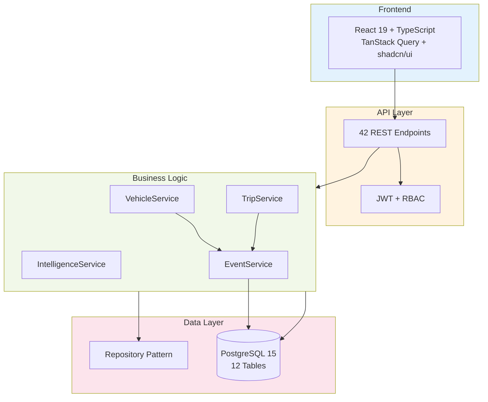
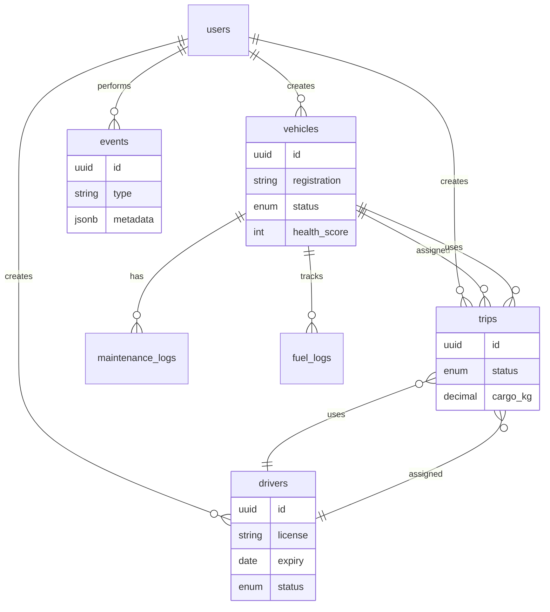

# TransitOps360

**Fleet Operations ERP with Operational Intelligence and Analytics**

Built for Odoo Hackathon 2026. A modern fleet operations ERP combining business rule enforcement, operational analytics, and end-to-end workflow automation.

[](https://fastapi.tiangolo.com/)
[](https://react.dev/)
[](https://www.postgresql.org/)
[](https://www.typescriptlang.org/)

---

## 📊 What We Built

| Metric | Count |
|--------|-------|
| REST Endpoints | 42 |
| Database Tables | 12 |
| Business Services | 8 |
| State Machines | 3 |
| Lines of Code | ~4,300 |
| Build Time | 6 hours |

**Status**: ✅ Backend complete (42 endpoints working) · ✅ Frontend complete (100% integrated)

> 📖 **[Full Documentation →](./docs/)** | Guides, troubleshooting, API docs, and more

---

## The Problem

- Manual dispatch wastes 10-15% fuel efficiency
- Reactive maintenance causes downtime
- Missed renewals = compliance violations
- Zero audit trail when issues arise

---

## Our Solution

**Unified control plane** that combines ERP fundamentals with operational intelligence:

- **Smart Dispatch**: Multi-factor scoring (capacity 40%, fuel 30%, health 20%, availability 10%)
- **Fleet Health**: Dynamic 0-100 scores based on maintenance, age, efficiency
- **Compliance Alerts**: 30-day proactive warnings for expiring documents
- **Cost Intelligence**: Per-vehicle ROI and profit analysis
- **Audit Timeline**: Immutable event log with JSONB metadata
- **Auto-Status Management**: Maintenance opens → vehicle to "In Shop", closes → "Available"

---

## What Makes This Different


1. **Algorithmic decision support** - Not CRUD, actual scoring recommendations
2. **15+ business rules** - Enforced at DB, service, and API layers
3. **Event-driven architecture** - Every action generates immutable audit records
4. **State machine enforcement** - PostgreSQL enums + service validation prevent invalid transitions
5. **Real operational intelligence** - Dashboard aggregates data for actionable insights

---

## Architecture



**Strict layering**: Router → Service → Repository → Database (zero violations)

---

## Core Features

### ✅ Implemented

- **Fleet Management**: Vehicle/driver CRUD, status tracking, document expiry
- **Operations**: Trip dispatch with validation, maintenance workflow automation
- **Intelligence**: Smart dispatch scoring, health engine, compliance center, cost analytics
- **Audit**: Complete event trail with JSONB metadata
- **Security**: JWT auth, bcrypt passwords, RBAC (4 roles)

### 🔮 Future

- Real-time WebSocket notifications
- ML-based predictive maintenance
- Mobile PWA for drivers
- Multi-tenant architecture

---

## Engineering Highlights


**Repository-Service Pattern**: Business logic isolated from data access for testability

**Event-Driven Audit**: Every action generates immutable events with JSONB metadata for complete traceability

**State Machines**: PostgreSQL ENUMs + service validation enforce valid transitions (Vehicle, Driver, Trip)

**Smart Dispatch**: Deterministic weighted scoring algorithm (explainable, debuggable, predictable)

**JWT + RBAC**: Stateless auth with 4 roles (Fleet Manager, Dispatcher, Safety Officer, Financial Analyst)

---

## Database



**12 tables** · **20+ indexes** · **UUID PKs** · **Soft deletes** · **JSONB metadata** · **CASCADE/RESTRICT rules**

---

## Demo Flow

1. **Login** with admin/admin123
2. **Create vehicle** MH12AB1234, Tata Ace, 1200kg
3. **Create driver** with license expiry 2025-12-31
4. **Create trip** Mumbai → Pune, 800kg cargo
5. **Get recommendations** - see scored vehicle-driver pairs
6. **Dispatch trip** - watch statuses auto-update to "On Trip"
7. **Open maintenance** - vehicle auto-transitions to "In Shop"
8. **View timeline** - see complete audit trail with metadata

---

## Odoo Alignment


- **Unified data model** - Single source of truth, referential integrity
- **Modular architecture** - Clear module boundaries (Fleet, Operations, Intelligence)
- **Business automation** - Maintenance/dispatch workflows auto-update statuses
- **Audit trail** - Event logging similar to Odoo's chatter system
- **RBAC** - Role-based permissions like Odoo's group security

**Integration potential**: Accounting (trip revenue → journal entries), HR (drivers → employees), Inventory (parts → stock)

---

## Quick Start

```bash
# Database
docker-compose up -d postgres

# Backend
cd backend
python -m venv venv && source venv/bin/activate  # Windows: venv\Scripts\activate
pip install -r requirements.txt
alembic upgrade head
python scripts/seed_data.py
uvicorn app.main:app --reload --port 8001

# Frontend
cd frontend
npm install && npm run dev
```

**Access**: http://localhost:5173 · **API Docs**: http://localhost:8001/docs · **Login**: admin/admin123

---

## Tech Stack

**Backend**: FastAPI · SQLAlchemy 2.0 · Alembic · Pydantic · python-jose · bcrypt  
**Frontend**: React 19 · TypeScript · TanStack Query · shadcn/ui · TailwindCSS  
**Database**: PostgreSQL 15 · UUID PKs · JSONB · ENUMs  
**DevOps**: Docker Compose

---

## Team

Built by 2 developers in 6 hours using spec-driven development (Requirements → Design → Tasks → Implementation).

**Backend**: FastAPI architecture, business logic, dispatch algorithm, migrations, 42 endpoints  
**Frontend**: React setup, component library, API integration, charts

---

## Future Vision

**Short term**: Complete frontend, unit tests, WebSocket notifications  
**Medium term**: ML predictive maintenance, route optimization, PWA  
**Long term**: Multi-tenant SaaS, driver mobile app, telematics integration

---

## 🏆 Why TransitOps360

- Goes beyond CRUD with operational decision support
- Enforces real-world fleet business rules
- Complete auditability through event-driven architecture
- ERP-aligned modular design
- Built with production-grade engineering practices

---

## Explainatory Video
**Link**:https://drive.google.com/file/d/10tmXGarAlrH8onrPO3KoaNEeXDZRMKfY/view?usp=sharing

---

## License

MIT License - Odoo Hackathon 2026

---

Built for Odoo Hackathon 2026.
